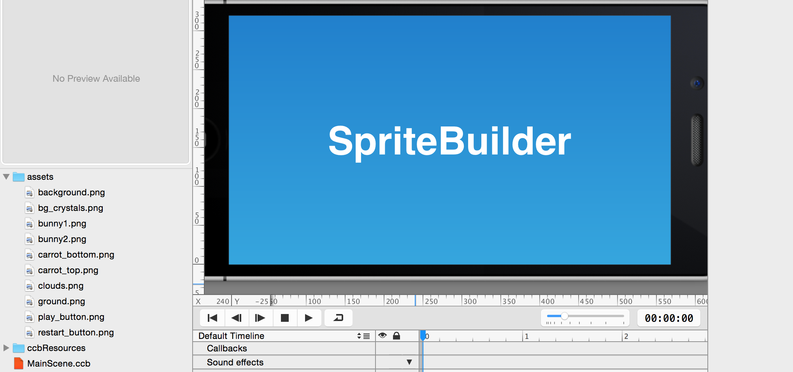

---
title: Learn to build Flappy Bird using Swift!
slug: build-flappy-bird-swift
---            

**Learn to build Flappy Bird using Swift and Cocos2D!**

* * *

<!--Flappy fly-->

This is the updated Swift version of the [Objective-C Flappy Fly Tutorial](https://www.makeschool.com/gamernews/369/build-your-own-flappy-bird-with-spritebuilder-and?source=mgwu) for SpriteBuilder and Cocos2D. Thanks for the initial [Flappy Fly Swift port](http://forum.cocos2d-swift.org/t/flappyfly-tutorial-has-been-portet-to-swift-syntax/16045) goes to Cocos2D user Aleksey "GameOver" Zhilin!

# What you will learn

This tutorial will teach you how to implement a Flappy Bird clone for iOS using Apple's new Swift programming language together with SpriteBuilder and Cocos2D. You'll start with a blank project.

If you aren't familiar with SpriteBuilder, you should consider reading our [SpriteBuilder beginner tutorial](https://www.makegameswith.us/tutorials/getting-started-with-spritebuilder/) first since this tutorial assumes that you are familiar with basic SpriteBuilder tasks.

If you complete this tutorial you will learn how to:

*   implement an endless scroller
*   implement procedural level generation
*   use physics with Cocos2D
*   use Swift with Cocos2D

The solution to this [tutorial is available on GitHub](https://github.com/MakeGamesWithUs/FlappyFly-Swift):

Let's get started with *Hoppy Bunny Swift!*

# Getting Started

First of all let's do a quick version check. This tutorial is written using SpriteBuilder v1.4 and the bundled Cocos2D v3.4. 

You can check your SpriteBuilder version by opening the *About SpriteBuilder* dialog:

Using a different version of SpriteBuilder or Cocos2D may lead to different results in some of the steps, especially if you use older versions - some things just might not work. In case you have problems resolving version issues, please post your question on the [SpriteBuilder forum](http://forum.spritebuilder.com).

## Basic concepts of a side scroller in Cocos2d

If you have never built a side scroller before, this introduction will help you understand the basic concepts. Some developers start developing a side scroller with a static (immovable) hero and a level that scrolls towards this hero. However, for physics engines, it is a lot easier if the hero moves through the world/level rather than the entire world moving toward the hero, so that's what we'll do here. 

We will implement the game as follows:

*   The obstacles in the level are static
*   The fly moves to the right at constant speed
*   The camera follows the bunny
*   The objects are created on the right side before they come into view
*   The objects are deleted once they've moved outside the left boundary of the view

## Create a new project

The first step is to create a new SpriteBuilder project by opening SpriteBuilder and selecting File -> New -> Project. You need to select Swift as the *Primary Language* in the *New File* dialog as highlighted below: 

## Adding Artwork

After the project is created, you should [download our art pack for this game](https://s3.amazonaws.com/mgwu-misc/FlappyFlyArtPack.zip). Add the art pack you just downloaded to your SpriteBuilder project by first unpacking the archive, then dragging the folder onto the File View in SpriteBuilder (lower left area where files & folders are displayed):

# Setup the Gameplay scene

Before you start, you'll have to make changes to the project settings. *Hoppy Bunny Swift* is a portrait mode game and the assets for the game are provided in 2x (iPhone retina resolution). 

Open the project settings and adjust these two settings:

As a test, publish your project and run it in Xcode.

You can publish your project by pressing the button in the top left corner of SpriteBuilder, or by selecting File -> Publish. **Remember: you must publish your changes for them to be visible in XCode!**

To open your project in XCode, select File -> Open Project in XCode. While in XCode, you can run your project by going selecting Product -> Run. 

Your app should be displayed in portrait mode.

## Empty the Stage

First, remove the "SpriteBuilder" label and the gradient node from the *MainScene*. You should be left with a blank (black) stage.

## Add the Background Image

Add the background image by dragging `background.png` onto the stage:

<!--Discuss relative corner, position percentage vs points, and anchor point-->

Set the reference corner to the top left. This has the effect that the position of the background will be interpreted as being relative to the top left corner, with the positive Y axis pointing downwards (just like in Cocoa/UIKit). Set position to (0,0) and anchor point to (0,1). 

The background will now stick to the top left corner, independent of the device size. This is important because we want to support 3.5-inch and 4 inch iPhones. 

You can preview how your app will look on other devices by toggling through the Resolution settings:

## Add the Ground Image

Add the ground image by dragging it onto the stage:

You'll notice the ground image extends beyond the screen border. Doing this ensures it will cover the screen, regardless of the current device's screensize.

<!--Explain why we use a specific point value for position here-->

Set the reference corner of the ground sprite to the bottom left (default). Set the position to (0, 12) and the anchor point to (0,0). This way the ground will stick to the left bottom, independent of the screen size.

## Add the Clouds Image

Add the clouds to the scene:

Set the reference corner to the top left. As position use either `(187, 134)`, or any other value you think looks good. Enjoy this creative freedom. ;)

# Creating the Bunny

Now you're going to create a new *CCB-File* for the bunny and add a sprite animation to it.

## Create the Bunny Document

Create a new *CCB-File* of type *Sprite*:

Select the CCSprite in the Node Tree and set its sprite frame property to *bunny1.png* from the art pack:

## Animate the Bunny

In case you have problems with any of the following steps, you might want to take a look at the [sprite frame animation chapter](https://www.makegameswith.us/tutorials/getting-started-with-spritebuilder/animating-spritebuilder/) in our beginner tutorial, which explains timeline animations in detail.

The animation you are about to define will be 1 second long and infinitely looping. First, you need to set the timeline duration to 1 second:

Next, insert six evenly spaced *Sprite Frame Keyframes*, which will repeatedly switch between the two images *bunny1.png* and *bunny2.png*. This is how you insert a Sprite Frame Keyframe:

Note that the *CCSprite* needs to be selected in the timeline in order to add a Keyframe. Add 6 of these Sprite Frames and use the *Sprite Frame* property of the *CCSprite* to switch between the two different bunny images. 

Alternatively, you can select the bunny sprite, then select the *bunny1.png* and *bunny2.png* images, then right-click and choose *Create Keyframes from Selection*. You can then copy & paste the keyframes until you have a total of 6 keyframes.

The last step is to chain the timeline to itself so that the animation is repeated infinitely. This can be done at the bottom of the timeline bar. Once you are done, the result should look like this:

# Let the Bunny fall

Next, you'll enable physics on the bunny and add a physics node to the scene.

## Add the Physics Node

Because the *Hoppy Bunny Swift* game uses physics, you need to add a *CCPhysicsNode*. Open *MainScene.ccb* and drag a *Physics Node* from the Node Library View onto the stage. Set the size of the Physics Node to be a 100% of the parent's size:

## Make the Ground Static

Select the ground node. On its Item Physics tab, enable physics and make it a *Static* body.

Drag the ground node into the timeline so it becomes a child of the *CCPhysicsNode*. Remember that every Node that has physics enabled needs to be below a *CCPhysicsNode* in the hierarchy; otherwise, it will not behave like a physics object, nor will it collide with other physics bodies.

## Enable Bunny Physics

Open *Hero.ccb* and select the Bunny sprite. Switch to the Item Physics tab and check the enable physics checkbox. Make sure the body type is set to *Dynamic*.

### Add the Bunny to the World

To add the bunny to the game, drag the *Hero.ccb* file onto the stage. This will automatically create a *Sub File* node referencing the *Hero.ccb* contents. Make the Bunny a child of the CCPhysicsNode (drag & drop in the timeline to reorder it).

Sometimes *Sub Files* are not displayed properly when initially placed into a scene. If a *Sub File* is not visible, publish your project. If it is still not visible, check its order in the animation timeline as it may be hidden under something else in the scene.

## Add the Crystals

Before you run the game, let's add some crystals above the ground to complete the visual appeal of *Hoppy Bunny Swift* by adding `bg_crystals.png` onto the stage:

<!--Readdress why we are using absolute value positions, as in "like the ground node before, we know the art is blah blah blah"-->

Set the *position* of the crystal to `(160.0, 134.0)`. Make sure all the decorative elements are placed above the *CCPhysicsNode* in the timeline. This will ensure that the hero and ground will be drawn in front of the background images like the clouds and crystals.

## Check your Progress

You are ready to publish your project and run the App from Xcode! When you run your project, you should see the bunny slowly sailing down and coming to a rest on the ground:

Great! Now let's get our bunny hopping!

# Add controls and tune physics

At the moment the fly drops to the floor (slowly) and there is nothing a player can do to stop this! In this section you are going to tune some physics values and add touch controls so that the player can stop the fly from falling down.

## Change the Gravitational Constant of the Universe

Let's [just redefine gravity](https://www.youtube.com/watch?v=5xdbPhnfFEI) by selecting the physics node in the *MainScene.ccb*, then increase the gravity property to -700 to make the bunny drop faster:

## Making Code Connections

Before we can control the bunny via XCode, we first must make a connection to it in SpriteBuilder. To do this, select your bunny in *MainScene.ccb* and go to the code connections tab (second tab on the top-right). Give the bunny the variable name *hero*, and make sure it's a Doc root var:

Be sure to publish your project! Go to XCode and navigate to *MainScene.swift*. In order to control our bunny, we need to complete the code connection. Make your  *MainScene.swift* look like the following:

	import Foundation
	
	class MainScene: CCNode {
  		weak var hero: CCSprite!
  	}

We now have what's called a reference to the bunny, which means we can manipulate the specific bunny object we placed in *MainScene.ccb* by using `hero` in *MainScene.swift*. But what good is a reference if we don't do anything with it? Let's start hopping!

## Adding Touch Input

Our goal is to have our bunny hop every time we touch the screen.

First, let's enable touch events in *MainScene.swift* by adding the method `didLoadFromCCB()`, which is called every time a CCB file is loaded. Inside the method, we'll enable touch events. Add the following code to *MainScene.swift*:

	func didLoadFromCCB() {
		userInteractionEnabled = true
	}

Then add another method to *MainScene.swift* which applies an impulse to the bunny every time a touch is first detected:

    override func touchBegan(touch: CCTouch!, withEvent event: CCTouchEvent!) {
        hero.physicsBody.applyImpulse(ccp(0, 400))
    }

<!--Perhaps should be more concise-->

You'll notice the keyword `override` appears before `func` in the declaration of this method. An important concept in object-oriented programming is the idea of inheritance - that is, a child class inherits methods and properties from their parent class. *MainScene.swift* is a child of *CCNode*, which is indicated by the line `MainScene: CCNode`. *CCNode* has a `touchBegan(...)` method, so we must use the `override` keyword to indicate that our child class will override its parent's implementation of `touchBegain(...)`.

**Note:** For now it is best to use the physics values provided in this tutorial. Once you completed the tutorial you can spend time tweaking the values.

Run the game again to verify that the bunny can be controlled by touches.

## Adding a Speed Limit

As you may have noticed while testing the touch implementation: when you touch the screen repeatedly in short intervals, the impulses add up and the bunny shoots out of the top edge of the screen, gone for seconds or even (seemingly) forever. As in most physics games, you will have to add some tweaking variables. For this game, you will want to limit the vertical upward velocity. The best way to limit the bunny's speed is via the *update* method, which is called every frame in a Cocos2D object. 

Add the following method to *MainScene.swift* to limit the bunny's vertical velocity:

    override func update(delta: CCTime) {
    	let velocityY = clampf(Float(hero.physicsBody.velocity.y), -Float(CGFloat.max), 200)
    	hero.physicsBody.velocity = ccp(0, CGFloat(velocityY))
    }

Clamping means testing and optionally changing a given value so that it never exceeds the specified value range. 

Using this method, you are limiting the upwards velocity to 200 at most. By using the negative *-Float(CGFloat.max)* value as the minimum value, you avoid artificially limiting the falling speed. You don't need to set the x velocity because you will be setting the x *position* manually, so modifying the x velocity here would have no effect.

## Make the bunny rotate

One of the nice details of Flappy Bird is the way the bird rotates. When the player does not touch the screen for a little while the bird turns towards the ground, touching the screen makes the bird turn upwards again. You are going to imitate this behavior in Hoppy Bunny!

There are a couple of things you will need to do to achieve this:

*   On touch turn the fly upwards
*   If no touch occurred for a while, turn the fly downwards
*   Limit the rotation between slightly up and 90 degrees down (just as in Flappy Birds)

First step: add a property to keep track of the time since the last touch. Add this declaration just below the code connection:

    var sinceTouch : CCTime = 0

Next, extend the touch method to trigger the upward rotation on a touch. You implement this by applying an angular impulse to the physics body. You also need to reset the *sinceTouch* value every time a touch occurs:

    override func touchBegan(touch: CCTouch!, withEvent event: CCTouchEvent!) {
        hero.physicsBody.applyImpulse(ccp(0, 400))
        hero.physicsBody.applyAngularImpulse(10000)
        sinceTouch = 0
    }

This is how your *touchBegan* method should look now. Applying a high angular impulse will lead to the bunny turning upwards fast. If you like to see the bunny spinning wildly, go ahead and try the game now.

You still need to limit the rotation of the bunny and start a downward rotation if no touch occurred in a while. You will do both in the update method. Add these lines at the end of your update method:

        sinceTouch += delta
        hero.rotation = clampf(hero.rotation, -30, 90)
        if (hero.physicsBody.allowsRotation) {
            let angularVelocity = clampf(Float(hero.physicsBody.angularVelocity), -2, 1)
            hero.physicsBody.angularVelocity = CGFloat(angularVelocity)
        }
        if (sinceTouch > 0.3) {
            let impulse = -18000.0 * delta
            hero.physicsBody.applyAngularImpulse(CGFloat(impulse))
        }

There are a couple things going on here. First, you add the *delta* (change in) time to the *sinceTouch* value to capture how much time has passed since the last touch. In the next line, we limit the rotation of the bunny.

Next, you check if the bunny allows rotation because later, you will disable rotation upon death. If rotation is allowed, you clamp the angular velocity to slow down the rotation if it exceeds the value range. Then you apply that new angular velocity.

Finally, you check if more than three tenths of a second passed since the last touch. If that is the case, a strong downward rotation impulse is applied.

Now run your game again. The behavior should be similar to this:

Hopping up and down is fun, but it would be even better if our bunny was going somewhere!

# Scrolling the World

You are going to begin by moving the fly with a constant speed while updating the positions of movable objects. 

## Moving the Fly

First, create a code connection for the fly so that you can manipulate the velocity in code by entering *hero* in the *doc root var* field:

Now open Xcode, you are going to write (or copy & paste) some Swift code! Replace the entire content of the *MainScene.swift* file with this code:

	import Foundation

	class MainScene: CCNode {
	   	var scrollSpeed : CGFloat = 80
    	weak var hero : CCSprite!

	    override func update(delta: CCTime) {
        	hero.position = ccp(hero.position.x + scrollSpeed * CGFloat(delta), hero.position.y)
    	}
	}

This code adds a property for the code connection *hero*. It also defines a constant for the scroll speed because you will reference it from various points in the code. Lastly, the update method (which is automatically called every frame by Cocos2D) uses *scrollSpeed* to modify the x position of the fly. 

By multiplying the scroll speed with *delta* time you ensure that the fly always moves at the same speed, independent of the frame rate. 

**Caution:** Setting the position of a node with a physics body manually in the update method is not the best use of the physics engine, since a node with a physics body is supposed to have its position updated by the body. But in this tutorial the focus is on cloning Flappy Birds and not on physics best practices.

Once you added this code you can run your App. You should see the fly falling down and slowly grinding over the floor until it leaves the right edge of the screen.

You're right; as a next step you should definitely set up some kind of "camera" that follows the fly.

## Setting up a "Camera"

Cocos2D does not have the concept of a camera - though *CCActionFollow* comes close to it with Cocos2D v4 being expected to make great improvements in this area. But for now you will have to implement the camera mechanism by yourself - with our help, of course - and it's actually rather straightforward.

You can scroll the view by moving the complete content of the game to the left. To the player this looks the same as if the camera is moving to the right - in the end all movement is relative.

Just as in Flappy Bird the background images will be all static. The only things scrolling will be the obstacles and the ground. To implement the camera, you just need to move the *Physics Node* to the left - obstacles, ground and hero are children of the physics node and will move in relation to their physics node parent.

To scroll the physics node in code you need to setup a code connection for the physics node. Select the physics node, then enter *gamePhysicsNode* in the *doc root var* field:

Now switch to Xcode and create a new property called *gamePhysicsNode* for this code connection. Add the following line to *MainScene.swift* just below the line that declares the *hero* property:

    weak var gamePhysicsNode : CCPhysicsNode!

Next you are going to add a second line to your update method that moves the physics node:

    override func update(delta: CCTime) {
        hero.position = ccp(hero.position.x + scrollSpeed * CGFloat(delta), hero.position.y)
        gamePhysicsNode.position = ccp(gamePhysicsNode.position.x - scrollSpeed * CGFloat(delta), gamePhysicsNode.position.y)
    }

The update method should now contain two lines; one to move the fly and the other to scroll the physics node.

You should test out your game again.

Yay, the scrolling works! However, when the game scrolls too far to the right the ground disappears and the fly drops into nirvana. The problem is that by moving the complete physics world to the left, you are also moving the ground to the left but it is only wide enough to fill the width of one screen.

## Loop the Ground

You can make the ground loop by adding a second ground sprite and implement an endless scrolling using both ground sprites. 

When a ground sprite leaves the left edge you'll move it to the right edge of the screen to make the ground seem repeating endlessly.

### More Ground, Please

The first step will be adding a second ground sprite to the *MainScene.ccb*. It will help to turn off the iPhone frame by changing the *Stage Border* to *None* for the moment:

The easiest way to create another ground sprite is to duplicate the existing one via *Edit => Copy* and *Edit => Paste*. This has the advantage that you can make all settings below to one sprite, then copy it and only apply properties that are different. Alternatively you can just add a second ground image to the stage.

Drag the duplicated ground sprite below the *CCPhysicsNode*, if necessary. Set its position to (348,12). *348* is the width of the ground image, *12* is the y-Position of the first ground sprite. **Also set the anchor point to (0, 0.5), the same as the first ground sprite**. This way the two ground sprites will line up nicely. 

Now there are a couple of important steps to implement:

*   Ensure both ground sprites have physics enabled, and are set to be *Static* physics bodies
*   Create a *doc root var* code connection for both ground sprites:
	*   Name the first var *ground1*
	*   Name the other var *ground2*

If you followed all the steps closely you are now ready to go back to Xcode.

### Coding the Ground

In code you will have to add *ground1* and *ground2* properties for both ground sprites to complete the code connection. 

You should also add an array that will contain both of the ground sprites for easier processing later on. Insert the following code to the *MainScene* class, between the *gamePhysicsNode* var declaration and the *update* function:

    weak var ground1 : CCSprite!
    weak var ground2 : CCSprite!
    var grounds : [CCSprite] = []  // initializes an empty array

    func didLoadFromCCB() {
        grounds.append(ground1)
        grounds.append(ground2)
    }
    
In *didLoadFromCCB* you assign the two ground sprites to the *grounds* array to be able to loop through the ground sprites instead of having to juggle with the two identifiers *ground1* and *ground2*. The array is initialized when declared by simply assigning it an empty array. This avoids having to implement the *init* function.
    
In the update method you will perform a check for each ground sprite to see if it has moved off the screen, and if so, it will be moved to the far right and next to the ground sprite that's currently still visible on the screen. 

Change the update method in *MainScene.swift* so that it looks like this:

    override func update(delta: CCTime) {
        hero.position = ccp(hero.position.x + scrollSpeed * CGFloat(delta), hero.position.y)
        gamePhysicsNode.position = ccp(gamePhysicsNode.position.x - scrollSpeed * CGFloat(delta), gamePhysicsNode.position.y)
        
        // loop the ground whenever a ground image was moved entirely outside the screen
        for ground in grounds {
            let groundWorldPosition = gamePhysicsNode.convertToWorldSpace(ground.position)
            let groundScreenPosition = convertToNodeSpace(groundWorldPosition)
            if groundScreenPosition.x <= (-ground.contentSize.width) {
                ground.position = ccp(ground.position.x + ground.contentSize.width * 2, ground.position.y)
            }
        }
    }

This code retrieves the current screen position for each ground sprite. Since the ground sprites aren't children of the *MainScene* (*self*) you need to get the world position of the ground sprites first, then use the *convertToNodeSpace* method to convert the position in *MainScene* (*self*) coordinate space. 

Once you have the position you check if a ground sprite is off the screen. If that is the case, you move it to the right of the other ground sprite. This creates the ground's endless repeating effect.

If you run the game now, the ground will scroll endlessly as the fly moves about.

# Adding obstacles

Now you will be adding obstacles and implement a mechanism to randomly create more obstacles as you fly along the level.

Go back to SpriteBuilder and create a new *CCB File* of type *Node* for the obstacles:

You will construct the obstacles with two pipes, one at the top and one at the bottom and *CCNode* in between which will be used as a goal trigger - the player's score increases when colliding with the goal node.

Add *pipe_top.png* and *pipe_bottom.png* to your new *Obstacle.ccb.* Also add a CCNode between these two pipes. There are a lot of ways to set the positioning for this obstacle up, but it is easier if you follow the instructions.

The root node:

Content size is (80, 568). The anchor point is (0,0).

The top pipe:

The reference corner is top left. The **X position is 50% of the parent size** and Y is set to 128. The anchor point is (0.5, 0).

The bottom pipe:

The reference corner is top left. The **X position is 50% of the parent size** and Y is set to 228. The anchor point is (0.5, 1).

The goal node position needn't be precise. Add a *Node* from the Node Library View to the Stage. This is what it should look like:

The reference corner is top left. The position is set to (22, 576). The anchor point is left at its default (0, 0). Most importantly the goal node has to be stretched over both pipes. It's supposed to become a trigger area.

It is important to get the pipe's positions right, to ensure that the obstacles look the same on an 3.5-inch and a 4-inch phone.

You can test if you setup the obstacle correctly by adding an instance of *Obstacle.ccb* to the *MainScene.ccb* by dragging the *Obstacle.ccb* onto the *MainScene.ccb* stage. Be sure to save the *Obstacle.ccb* document because CCB instances (represented by *Sub File* nodes) will always use the state of a document when it was last saved, but won't show any (as of yet) unsaved modifications. The result should be similar to this one:

Once you have successfully tested that the obstacle looks correct, remove it from *MainScene.ccb,* as you will write code to add obstacles.

## Generate obstacles in code

In this step you will create the obstacles from the *Obstacle.ccb* and add them to the game. 

Open Xcode and add the following properties to *MainScene.swift* just below the most recently added *sinceTouch* property:

    var obstacles : [CCNode] = []
    let firstObstaclePosition : CGFloat = 280
    let distanceBetweenObstacles : CGFloat = 160

You will use the *obstacles* array to keep track of the obstacles created. The two constants describe the x position of the first obstacle and the distance between two obstacles.

Now add the method that will take care of spawning obstacles:

    func spawnNewObstacle() {
        var prevObstaclePos = firstObstaclePosition
        if obstacles.count > 0 {
            prevObstaclePos = obstacles.last!.position.x
        }
        
        // create and add a new obstacle
        let obstacle = CCBReader.load("Obstacle")
        obstacle.position = ccp(prevObstaclePos + distanceBetweenObstacles, 0)
        gamePhysicsNode.addChild(obstacle)
        obstacles.append(obstacle)
    }

This method creates a new obstacle by loading it from the *Obstacle.ccb* file and places it within the defined distance of the last existing obstacle. If no other obstacles already exist the position of the first obstacle will be set to the *firstObstaclePosition* constant you just defined.

Now all you have to do is to call this method from the *didLoadFromCCB* method, which is called as soon as our scene's CCB document was initialized. Add this to the end of the *didLoadFromCCB* method:

    spawnNewObstacle()
    spawnNewObstacle()
    spawnNewObstacle()

This spawns three obstacles initially. You can try out the game now. You should see exactly three obstacles passing by, all at the same height, followed by - nothingness.

This will be our next task: spawning an endless number of obstacles!

## Spawning Endless Obstacles

You will now implement a mechanism that checks if an obstacle moved off the screen and spawns a new obstacle in place of this one. Alternatively, you can later try to re-use the obstacle that moved off-screen since loading resource files at runtime is quite slow - it's fine for this game but if you do that 10 to 100 times more often, that could become a performance issue.

Add these lines to the end of your *update* method:

    for obstacle in obstacles.reverse() {
        let obstacleWorldPosition = gamePhysicsNode.convertToWorldSpace(obstacle.position)
        let obstacleScreenPosition = convertToNodeSpace(obstacleWorldPosition)
            
        // obstacle moved past left side of screen?
        if obstacleScreenPosition.x < (-obstacle.contentSize.width) {
            obstacle.removeFromParent()
            obstacles.removeAtIndex(find(obstacles, obstacle)!)
                
            // for each removed obstacle, add a new one
            spawnNewObstacle()
        }
    }

The basics of this code should remind you of the ground looping we implemented previously. It checks which obstacles are off the screen and if so, removes that obstacle, then spawns a new obstacle. 

Note that we enumerate the *obstacles* array in reverse (backwards) so that we can legally remove and add objects at the end of the array while enumerating. More precisely: when enumerating an array in reverse it is legal to modify the contents of the array at indexes equal to or higher than the index that's currently being processed. This is a neat trick to avoid having to fill a "to be deleted" array with another for loop that removes the items in the "to be deleted" list for good.

Now run your game. You should see an endless amount of scrolling obstacles! All at the same height but still, you are getting closer to completing *Flappy Fly Swift*!

## Generating randomized obstacles

The next challenge you are going to tackle is generating randomized obstacles. This means you need to be varying the position of the gap between the two pipes. The first step is setting up a custom class for the obstacle. 

First, open *Obstacle.ccb* in SpriteBuilder, select the root CCNode and assign it the custom class *Obstacle*:

Also set up a *doc root var* code connection for the top and the bottom pipe sprites in the *Obstacle.ccb*. Enter in the *doc root var* field *topPipe* for the pipe\_top sprite and *bottomPipe* for the pipe\_bottom sprite.

Once you have setup everything create a new Swift class named *Obstacle* in Xcode.

Here's the complete content of the *Obstacle.swift* file at once. Add the following code to *Obstacle.swift*:

	import Foundation

	class Obstacle : CCNode {
		weak var topPipe : CCNode!
		weak var bottomPipe : CCNode!

		let topPipeMinimumPositionY : CGFloat = 128
		let bottomPipeMaximumPositionY : CGFloat = 440
		let pipeDistance : CGFloat = 142	   
		    
		func setupRandomPosition() {
			let randomPrecision : UInt32 = 100
			let random = CGFloat(arc4random_uniform(randomPrecision)) / CGFloat(randomPrecision)
			let range = bottomPipeMaximumPositionY - pipeDistance - topPipeMinimumPositionY
			topPipe.position = ccp(topPipe.position.x, topPipeMinimumPositionY + (random * range));
			bottomPipe.position = ccp(bottomPipe.position.x, topPipe.position.y + pipeDistance);
		}
	}

What is happening here?

At the top of the class you define the pipe code connections and a couple of constants. These constants describe the minimum and maximum positions for the top and bottom pipes. 

The values were chosen in such a way that every pipe at the top reaches at least 30 points into the screen for a 3.5-inch iPhone. This means on an iPhone 4S or older the top obstacle will always be clearly visible. The iPhone 5 and 5s will see a larger portion of the top pipe, but this will not change anything about the gameplay. Likewise, the maximum value for the bottom pipe is defined such that a pipe always sticks at least 30 points out of the ground to make it clearly visible.

In addition you defined a *pipeDistance* that describes how large the opening gap between the pipes should be.

Next the method *setupRandomPosition* uses the defined border values to calculate a random range. Since *arc4random* uses and returns *UInt32* it's important to generate a high enough number (here: *randomPrecision*), then divide by that same number to get a floating point value in the range 0.00 to 1.00.

The random value is used to define which portion of the possible pipe position Y range will be used. It uses the result to position the top pipe and positions the bottom pipe at the desired distances.

You can now use this method to generate random obstacles in our game. In *MainScene.swift* change the *spawnNewObstacle* method used to load an *Obstacle.ccb* document. All you really need to change is the CCBReader line to declare the value returned and assigned to the *obstacle*  constant as being of class *Obstacle*, then calling the *setupRandomPosition* method after assigning the initial position. The lines you need to replace respectively add are marked with appended comments:

    func spawnNewObstacle() {
        var prevObstaclePos = firstObstaclePosition
        if obstacles.count > 0 {
            prevObstaclePos = obstacles.last!.position.x
        }
        
        let obstacle = CCBReader.load("Obstacle") as! Obstacle   // replace this line
        obstacle.position = ccp(prevObstaclePos + distanceBetweenObstacles, 0)
        obstacle.setupRandomPosition()   // add this line
        gamePhysicsNode.addChild(obstacle)
        obstacles.append(obstacle)
    }

In the above code the return value of *CCBReader.load()* is cast to *as Obstacle* so that we can treat the loaded *Obstacle.ccb* as an instance of the *Obstacle* class. Additionally the new *setupRandomPosition* method you just implemented is called after loading an obstacle.

If you run the game now you should see random obstacles occurring! Before you move on to the last major step - implementing collisions - you are going to fix a small issue with the drawing order.

# Fixing the drawing order

Because you add the pipes in code, they are all drawn in front of the ground. By default Cocos2D renders the elements in the same order they were added as children, so the node(s) added last will be drawn on top of their sibling nodes. 

While you can use the zOrder property to fix that, it's a lot easier to use "layers". Basically all you need to create a layer is to add another node (acting as a "layer") in SpriteBuilder at the correct position in the hierarchy. Then add all objects that should be drawn in the same order to that "layer" node.

Open *MainScene.ccb* in SpriteBuilder and drag a *Node* from the Node Library View onto the CCPhysicsNode. Drag and move the newly added node so that it is the first node after CCPhysicsNode, and you may want to rename it to "obstacles layer":

Then select that *obstacles layer* node and set up a code connection. In the *doc root var* field enter *obstaclesLayer*.

Back in Xcode, add the following property to the end of the properties list in the *MainScene.swift* file:

    weak var obstaclesLayer : CCNode!

Finally, update the *spawnNewObstacle* method so that new obstacles aren't added to the *physicsNode* anymore but rather the new *obstaclesLayer* (I've omitted some code, and commented the line you need to replace):

    let obstacle = CCBReader.load("Obstacle") as! Obstacle
    obstacle.position = ccp(prevObstaclePos + distanceBetweenObstacles, 0)
    obstacle.setupRandomPosition()
    obstaclesLayer.addChild(obstacle)   // replace this line
    obstacles.append(obstacle)

Now you can run the App and see the pipes drawn behind the ground:

# The final steps: setting up collisions

You are going to set up collision handling so that your game finally becomes as frustrating as *Flappy Bird*. Any good game needs to be unforgiving and frustrating, right?

First, open *Obstacle.ccb* in SpriteBuilder in order to enable physics for the pipes. Select one of the two pipes, switch to the Item Physics tab and check the *Enable Physics* checkbox. Change the body type to *Static* and enter *level* in the *Collision Type* field, as shown in the screenshot below. Do this for both pipes.

Then open *MainScene.ccb* and set the *Collision Type* for both ground nodes to *level* as well.

Lastly, open *Hero.ccb* and select the CCSprite root node. Check the *Enable Physics* checkbox, set the body type to *Dynamic* and enter *hero* in the *Collision Type* field. Also uncheck both *Affected by Gravity* and *Allows Rotation* checkboxes.

**Note:** In SpriteBuilder v1.3 and earlier this part can not be completed as you can't set the body type to *Dynamic* without losing the existing sprite frame animation.

You set the collisionType to "level" to implement a collision callback method later whenever the "hero" collision type collides with a deadly "level" object (obstacles and the ground). Feel free to optimize the collision shapes for the pipes and the hero, they simply default to rectangular shapes otherwise which will make the collision behavior somewhat unforgiving.

But first, open *Obstacle.swift* in Xcode and add the *didLoadFromCCB* method to the *Obstacle* class with the following two lines:

    func didLoadFromCCB() {
        topPipe.physicsBody.sensor = true
        bottomPipe.physicsBody.sensor = true
    }

This changes the pipe's physics bodies to sensors. Setting the *sensor* value to *true* tells Chipmunk no actual collision feedback should be calculated, meaning the collision callback method does run but sensors will always allow the colliding objects to pass through the collision. 

You don't need an actual collision here because just touching an obstacle means instant death, just like in that other game ... what's it called ... ah, yes: *Flappy Bird*.

In *MainScene.swift* you need to declare that the *MainScene* class will implement (some of) the *CCPhysicsCollisionDelegate* protocol methods. You declare that a class is [implementing a protocol in Swift](https://developer.apple.com/library/ios/documentation/Swift/Conceptual/Swift_Programming_Language/Protocols.html) by appending *CCPhysicsCollisionDelegate* after the class' super class (CCNode), separated by a comma, as follows:

	class MainScene: CCNode, CCPhysicsCollisionDelegate

The *MainScene* class is now ready to be used as collision delegate. You should assign *MainScene* as the collision delegate class by adding the following line (anywhere) to the *didLoadFromCCB* method:

    gamePhysicsNode.collisionDelegate = self

Finally, you can implement a collision handler method. As parameter names you have to use the collision types *level* and *hero* that you defined earlier. Add this method anywhere to *MainScene.swift*:

    func ccPhysicsCollisionBegin(pair: CCPhysicsCollisionPair!, hero: CCNode!, level: CCNode!) -> Bool {
        NSLog("TODO: handle Game Over")
        return true
    }

The method above will be called whenever a object with collision type *hero* collides with an object of collision type *level*. 

Publish and run the app in Xcode. Any time you collide with the ground or a pipe the *TODO* message will be printed to the console.

## Implementing "Game Over"

Instead of only showing a message in the console, you surely want to implement a game over situation:

*   Fly falls to ground
*   Screen rumbles
*   Restart button appears
*   Game restarts when restart button is pressed

First, add a Button in SpriteBuilder to the *MainScene.ccb* document. Center the button by setting its position to 50%x50%, change its *Title* to *Restart* and set it to be invisible by unchecking the *Visible* property highlighted below:

Set up a code connection for the button by entering *restartButton* in the *doc root var* field. Also enter *restart* in the *Selector* field, this will be the method that runs whenever the button is pressed.

You will make the button visible once the game over situation occurs. Now switch to Xcode and open *MainScene.swift*, then add this property at the top of the class:

    weak var restartButton : CCButton!

Next, extend the collision handling method to show the restart button:

    func ccPhysicsCollisionBegin(pair: CCPhysicsCollisionPair!, hero: CCNode!, level: CCNode!) -> Bool {
        restartButton.visible = true;
        return true
    }

Lastly, implement the *restart* method that will be called when the restart button is pressed:

    func restart() {
        let scene = CCBReader.loadAsScene("MainScene")
        CCDirector.sharedDirector().replaceScene(scene)
    }

This method will reload the entire scene - restarting the game. Feel free to test this new functionality!

You will see that restarting the game works, but you don't have a real "game over" state yet. The scrolling goes on and there's no visualization of the game over situation.

Add a *gameOver* property at the beginning of the *MainScene* class, below or next to the other properties:

	var gameOver = false

Now add the new *triggerGameOver* method to *MainScene.m*, ideally add it next to the *restart* method as they belong together:

    func triggerGameOver() {
        if (gameOver == false) {
            gameOver = true
            restartButton.visible = true
            scrollSpeed = 0
            hero.rotation = 90
            hero.physicsBody.allowsRotation = false
            
            // just in case
            hero.stopAllActions()
            
            let move = CCActionEaseBounceOut(action: CCActionMoveBy(duration: 0.2, position: ccp(0, 4)))
            let moveBack = CCActionEaseBounceOut(action: move.reverse())
            let shakeSequence = CCActionSequence(array: [move, moveBack])
            runAction(shakeSequence)
        }
    }

Then call this new method from the collision handler, instead of just making the restart button visible:

    func ccPhysicsCollisionBegin(pair: CCPhysicsCollisionPair!, hero: CCNode!, level: CCNode!) -> Bool {
    	restart.visible = true
        triggerGameOver()
        return true
    }

You also need to update the *touchBegan* method to ensure that the user cannot "jump" when the game is over:

    override func touchBegan(touch: CCTouch!, withEvent event: CCTouchEvent!) {
        if (gameOver == false) {
            hero.physicsBody.applyImpulse(ccp(0, 400))
            hero.physicsBody.applyAngularImpulse(10000)
            sinceTouch = 0
        }
    }

You should run your app again and test the game over sequence. There is only one last point left: the points!

# Implementing points

Now that the player can die, you should implement the very last step: scoring points.

First create a *LabelTTF* in *MainScene.ccb* to display the current score:

Add a *doc root var* code connection to the label by entering *scoreLabel* in the corresponding field.

Now open *Obstacle.ccb* to enable physics on the *goal* node between the pipes. Make it a *Static* body and change its *Collision Type* to *goal*. Then switch to the Code Connections tab and set its *Custom Class* to *Goal*:

Yow switch to Xcode to implement increasing the score every time the player collides with one of the goals, which you take as the assumption that the player has passed (or at least reached) those pipes.

In Xcode create a new *Cocoa Touch Class* named *Goal* and set its language to Swift:

The initial contents of the *Goal.swift* file should be as follows:

	import Foundation

	class Goal: CCNode 
	{
	    func didLoadFromCCB() {
        	physicsBody.sensor = true;
    	}
	}

So basically you want to prevent the goal from stopping the player by making it a sensor body. This property can't (yet) be set within SpriteBuilder, so you have to do it in code. 

Of course you could also use the collision categories and masks, but that would be more complex and error-prone to set up and use up at least one category - and there can be at most 32 unique category strings. Alternatively, you could simply `return false` from the `ccPhysicsCollisionBegin` method but that should be a last resort option, since the Chipmunk manual recommends to use sensor or category filters first, as this will avoid the overhead of processing the collision and running the collision callback method.

You will use the *goal* collision type in *MainScene.swift* to detect when a player passed through a pipe. Open *MainScene.swift* and add the following two properties (score label and the score) at the beginning of the class:

    var points : NSInteger = 0
    weak var scoreLabel : CCLabelTTF!

Now, as a very final step, implement a second collision handler in *MainScene* that will be called when the player reaches a goal. Add this method to the *MainScene* class:

	func ccPhysicsCollisionBegin(pair: CCPhysicsCollisionPair!, hero nodeA: CCNode!, goal: CCNode!) -> Bool {
	   goal.removeFromParent()
	   points++
	   scoreLabel.string = String(points)
	   return true
	}

This will remove the goal node. Yes, in the Chipmunk physics engine it's legal to remove bodies during a physics collision callback method! Then the *points* counter is increased and assigned to the label's *string* property after it has been converted to a string.

**Note:** One frequently changing CCLabelTTF in a simple game like this is probably fine. But be aware that every time a CCLabelTTF string changes, the label's previous texture is discarded and a new one is created, then drawn using relatively slow Cocoa font rendering methods. See the performance note in the [CCLabelTTF class reference](http://www.cocos2d-swift.org/docs/api/Classes/CCLabelTTF.html).

Congratulations! Now you should see the complete game previewed at the beginning of this tutorial. You should have learned a lot along the way, especially regarding Swift and collision detection.

# Bonus: Using Sprite Sheet and fixing the "Black Line" artifact

Moving forward with any decent game, you will want to use Sprite Sheets (better known as Texture Atlas) for your image resources.

In this project you can simply right-click the *FlappyFlyArtPack* folder in SpriteBuilder, then select *Make Smart Sprite Sheet* to convert it to a sprite sheet. This will combine all images to a single texture, conserving precious runtime memory while also speeding up drawing of sprites using those images.

Whether you use PNG or PVR as the sprite sheet format, you will observe a common "black line" artifact that can pretty much show up anywhere in tiled graphics but is surprisingly simple to fix. First, see the highlighted issue - you may have seen that somewhere, sometime before:

To fix this quickly, open *MainScene.swift* and navigate to the *update* method. Add the following code just below the lines that assign values to the *hero.position* and *gamePhysicsNode.position*:

    gamePhysicsNode.position = ccp(round(gamePhysicsNode.position.x), 
                                round(gamePhysicsNode.position.y))

This rounds the physics node's position to the nearest integer coordinates. A position like 115.763, 213.298 is then rounded to 116.0, 213.0. This ensures the position is on pixel boundaries, preventing the subpixel rendering artifacts above.

Now if you consider that the positions in cocos2d is in points, not pixels, you'll know the above code does in fact round to the nearest point. On Retina devices this would limit the scrolling position (or rather: precision) to point coordinates, i.e. not using the full resolution of the Retina screen. You'll hardly notice the difference, if at all. On the other hand, moving the position of the physics node to actual pixel boundaries (Retina or not) is still quite simple.

Replace the above artifact fix code with the following enhanced code that properly rounds to Retina pixel boundaries:

    let scale = CCDirector.sharedDirector().contentScaleFactor
    gamePhysicsNode.position = ccp(round(gamePhysicsNode.position.x * scale) / scale, round(gamePhysicsNode.position.y * scale) / scale)

That's easy to explain. The content scale factor is 1.0 on non-Retina devices, and 2.0 on all Retina devices. On non-Retina devices the code has the exact same result - multiply and divide by 1.0 makes no difference. But on Retina devices, the position coordinates are first multiplied by 2.0 (i.e. 213.298 becomes 426.596) and then the rounding takes effect (new value: 427.0). Then the rounded value is divided by 2.0, resulting in a value whose fractional part is either .0 or .5 (here: 213.5). Since the position is in points, not pixels, and the Retina pixels resolution is twice the point resolution, any .5 coordinate is also on an exact pixel boundary.

You can apply this "black line" artifact to any situation where they occur. Just keep in mind that you'll want to apply the fix to "parent-most" node whose position changes, and you may need to apply it on child nodes as well. For instance if the player were a tile itself, it might also need to have its position rounded to the nearest pixel coordinate.

**If you enjoyed this you should apply to our [Summer Academy](http://makeschool.com/summer-academy/) and ship your own iPhone game this summer!** 

- Original Tutorial: [benji@makegameswith.us](mailto:benji@makegameswith.us)
- Updated and ported to Swift: [Steffen Itterheim](http://www.learn-cocos2d.com)