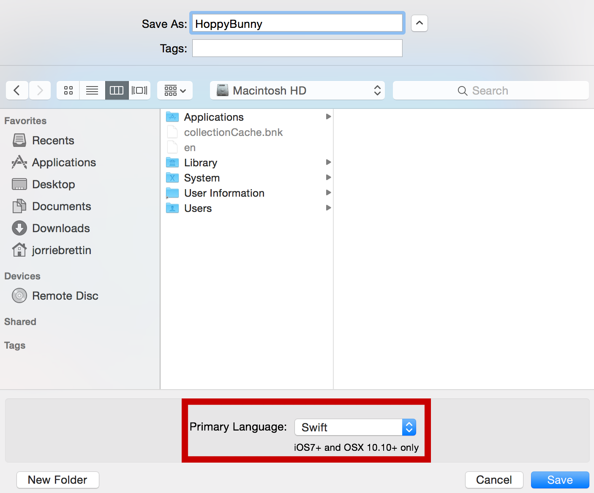
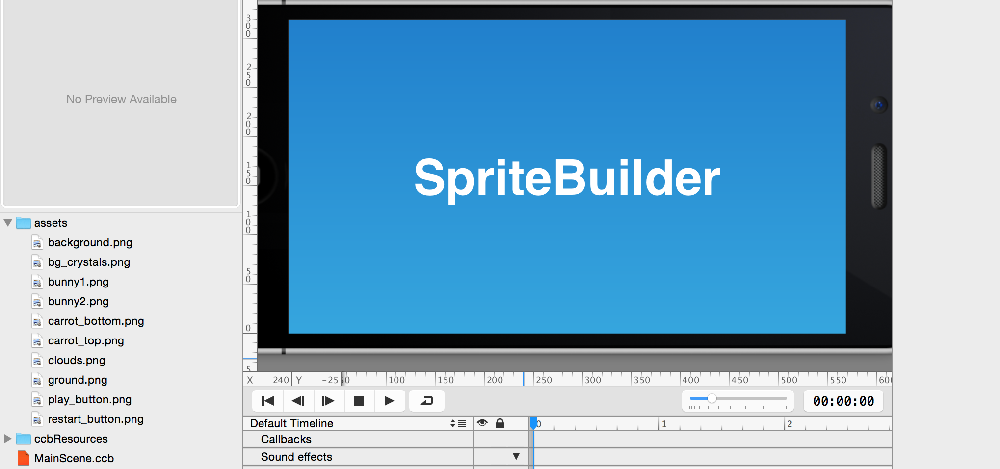

If you have never built a side scroller before, this introduction will help you understand the basic concepts. Some developers start developing a side scroller with a static (immovable) hero and a level that scrolls towards this hero. However, for physics engines, it is a lot easier if the hero moves through the world/level rather than the entire world moving toward the hero, so that's what we'll do here.

We will implement the game as follows:

*   The obstacles in the level are static
*   The bunny moves to the right at constant speed
*   The camera follows the bunny
*   The objects are created on the right side before they come into view
*   The objects are deleted once they've moved outside the left boundary of the view

#Create a new project

If you haven't already, it's time to make a SpriteBuilder project for Hoppy Bunny! If you did this in the *Getting started with SpriteBuilder and Cocos2D in Swift* tutorial, then move on to *Adding artwork*.

> [action]
> The first step is to create a new SpriteBuilder project by opening SpriteBuilder and selecting `File > New > Project`. You need to select `Swift` as the *Primary Language* in the *New File* dialog as highlighted below:
>
> 

#Adding artwork

> [action]
> After the project is created, you should [download our art pack for this game](https://github.com/MakeSchool-Tutorials/Flappy-Bird-SpriteBuilder-Swift/raw/master/assets.zip). Add the art pack you just downloaded to your SpriteBuilder project by first unpacking the archive, then dragging the folder onto the File View in SpriteBuilder (lower left area where files & folders are displayed):
>
> 
