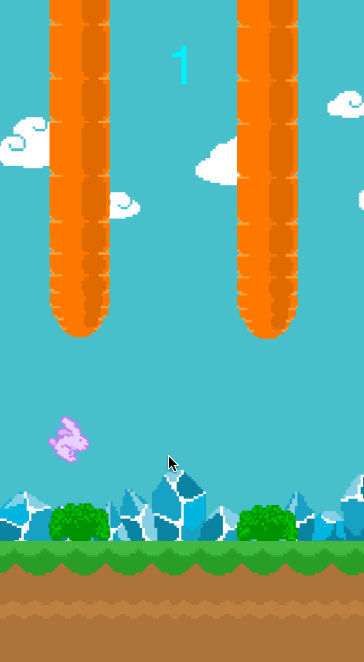

Congrats again on finishing *Hoppy Bunny* and building your first iPhone game!

At this point you have been introduced to many concepts in iOS game development. Most of these concepts will be reviewed and further explained in later tutorials so you'll get a chance to revist them later :)

Let's take a look at what you have learned so far.

###Creating a New Project

At the beginning of the Hoppy Bunny tutorials you learned how to create a new SpriteBuilder project and set it up with Cocos2D.

###Setting Up the Gameplay Scene

* **Importing assets**: You can drag assets directly into the resources pane on the left panel of SpriteBuilder.

* **Changing device orientation**: Device orientation for a project can be set in SpriteBuilder's project settings.

* **Setting up a background**: Backgrounds should be positioned relative to an edge (the edge you choose depends on the asset) and the anchor point should be set to the same edge as the asset is positioned to.

* **Creating a new CCB**: Interface files or CCBs can be created to contain custom objects based on CCNode and its subclasses.

* **Sprite frame animations**: You can animate CCSprites by setting keyframes to change the sprite frame at set times on the animation timeline. Chain a timeline to itself to repeat the animation endlessly.

###Letting the Bunny Fall

* **Physics nodes**: Physics nodes are used to contain physics simulations. Anything with a physics body must be a child of a physics node.

* **Static physics bodies**: Static physics bodies never move. They are great for ground and obstacles.

* **Dynamic physics bodies**: Dynamic physics bodies can be affected by gravity and other forces.

* **CCB sub-files**: CCB files can be added to other CCB files. This will allow you to reuse game elements.

###Adding Controls and Tuning Physics

* **Gravity property**: The gravitational constant of a physics node can be set through the properties pane (right hand side of SpriteBuilder UI).

* **Class code connections**: Class code connections can be used to set a custom class for a node. This class gets initialized by when the CCB file is loaded in through code.

* **Variable Code connections**: Code connections allow you to access SpriteBuilder elements in code. They are created in SpriteBuilder and completed in the root node's class file using the format `weak var connectionName: ConnectionType!`.

* **Touch input**: Touches can be received by a node if you set `userInteractionEnabled` to `true` and override `touchBegan`.

* **Update loop**: Update loops are called between every frame. They can be created by overriding `update`.

* **Impulses**: `applyImpulse` adds directly to the velocity property of a physics body. `applyAngularImpulse` adds directly to the angular velocity property of a physics body.

###Scrolling the World

* **Implementing a "camera"**: We implemented a "camera" by moving the physics node the same amount (in the opposite direction) as the bunny moved forward.

* **Looping elements**: The ground was looped once it went off screen. We added a second ground image so that at least one full ground was always visible.

###Adding Obstacles

* **Endless generation**: We generated enough obstacles so that there was one waiting just off screen. Once one left the screen behind the bunny, we removed it and added a new one off screen.

* **Random placement**: When we generated an obstacle, we randomized it's y-position value. This worked because the obstacles asset was larger than the screen height (so we part of it was always off screen).

* **Controlling draw order**: You can control the placement of objects added in code by adding them to an empty node set up in SpriteBuilder. The node's draw order controls the objects draw order.

###Setting Up Collisions

* **Collision types**: Collision types are strings that are set in SpriteBuilder so you can recognize collisions between specific objects.

* **Physics sensors**: Physics sensors detect and trigger collision events but do you resolve the collisions. It's as if the physics bodies can pass through other physics bodies. These are useful for trigger events.

* **Collision delegate**: You implement a collision delegate so your class can receive collision events from the physics engine.

* **Collision begin handler**: The collision begin handler gets called at the start of a collision. You use the collision type as external paramenters in the method definition.

* **Game over**: It is useful to have a game over state or boolean to stop the game loop and ignore touches after a game over.

###Implementing Points

* **Goals using physics sensor**: Physics sensor goals were placed between obstacles so you can use a collision begin handler to detect when a player passed an obstacle.

* **Updating a label**: Labels can be automatically updated by creating `didSet` property observer on the variable that contains the information they display.

###Using a Sprite Sheet

* **Sprite sheets**: Sprite sheets can be enabled in SpriteBuilder. They tightly pack assets in a single texture for optimized loading.

* **Fixing black line artifacts**: Black line artifacts happen because a sprite is positioned at a non-whole number position. They can be removed by round the position before you set it.

###Solution

The solution to this [tutorial is available on GitHub](https://github.com/MakeSchool/HoppyBunny-SpriteBuilder-Swift).

