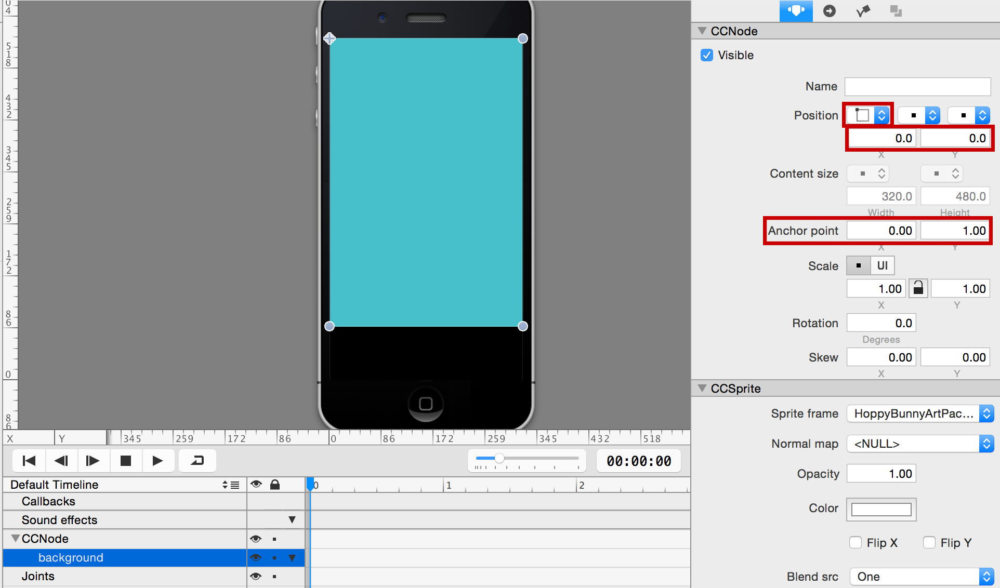
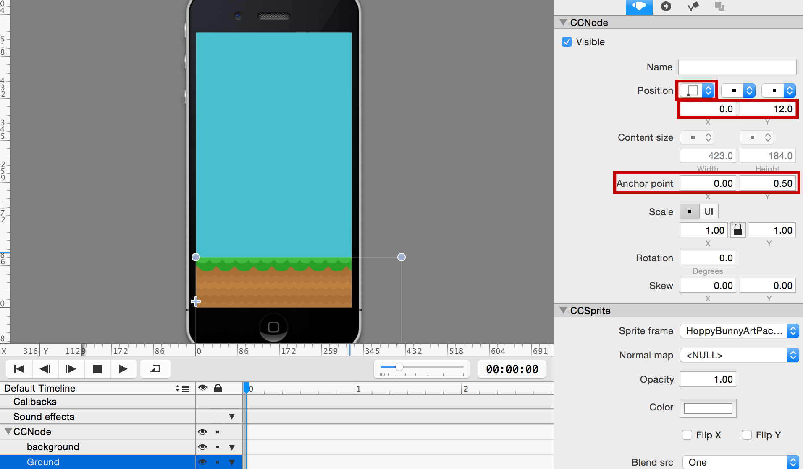
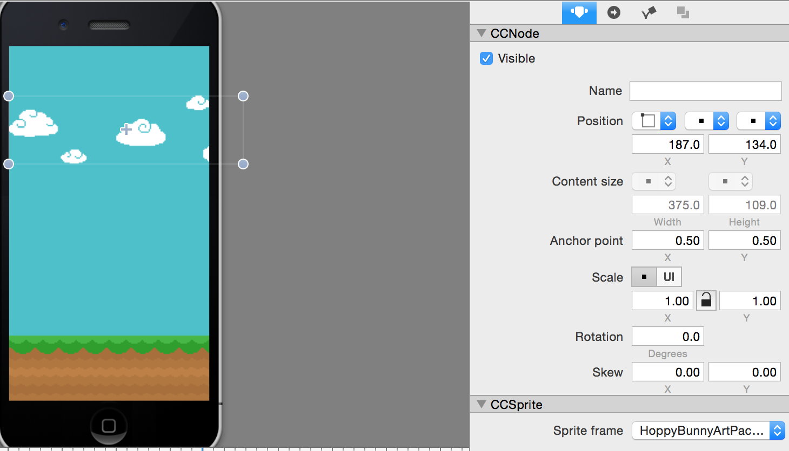
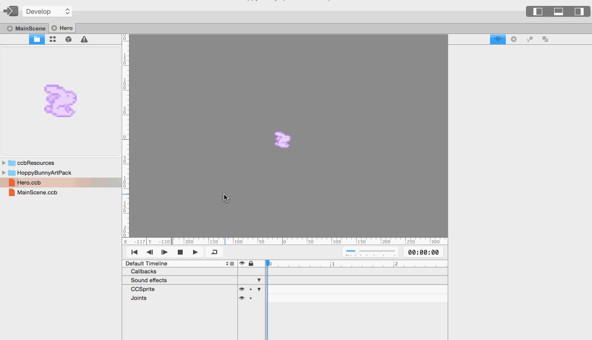
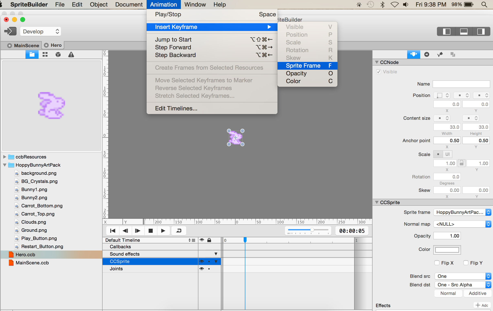
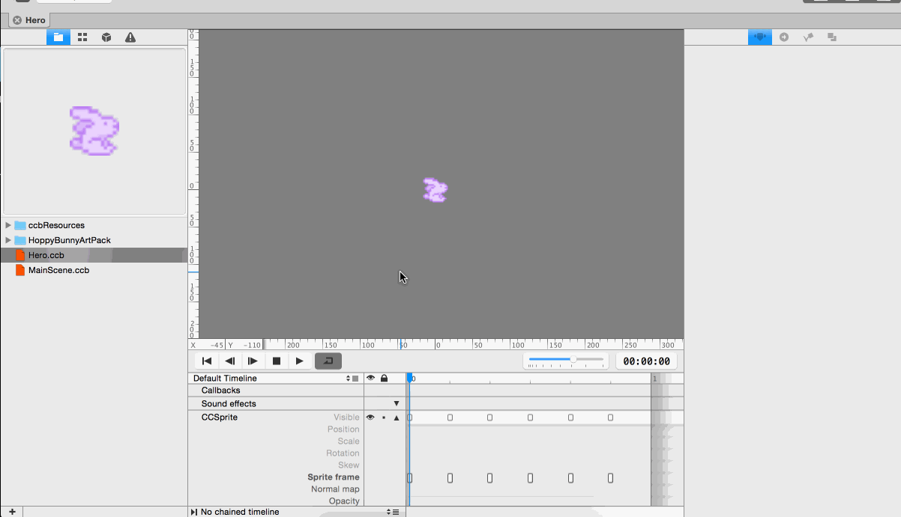

Before you start, you'll have to make changes to the project settings. *Hoppy Bunny Swift* is a portrait mode game and the assets for the game are provided in 2x (iPhone retina resolution).

> [action]
> Open the project settings and adjust these two settings:
>
> 

As a test, publish your project and run it in Xcode.

> [action]
> You can publish your project by pressing the button in the top left corner of SpriteBuilder, or by selecting File -> Publish. **Remember: you must publish your changes for them to be visible in Xcode!**
>
> To open your project in Xcode, select File -> Open Project in Xcode. While in Xcode, you can run your project by going selecting Product -> Run.
>
> Your app should be displayed in portrait mode.

#Empty the stage

> [action]
> First, remove the "SpriteBuilder" label and the gradient node from the *MainScene*. You should be left with a blank (black) stage. You can do this by clicking on them and pressing the delete key.

#Add the background image

> [action]
> Add the background image by dragging `background.png` onto the stage:
>
> 
>
> Set the reference corner to the top left. This has the effect that the position of the background will be interpreted as being relative to the top left corner, with the positive Y axis pointing downwards (just like in Cocoa/UIKit). Set position to (0,0) and anchor point to (0,1).

The background will now stick to the top left corner, independent of the device size. This is important because we want to support 3.5-inch and 4 inch iPhones.

> [info]
> You can preview how your app will look on other devices by toggling through the Resolution settings:
>
> 

#Add the ground image

> [action]
> Add the ground image by dragging it onto the stage:
>
> 

You'll notice the ground image extends beyond the screen border. Doing this ensures it will cover the screen, regardless of the current device's screensize.

> [action]
> Set the reference corner of the ground sprite to the bottom left (default). Set the position to (0, 12) and the anchor point to (0,0.5). This way the ground will stick to the left bottom, independent of the screen size.

The *x-position* value of 0 is important. This keeps the ground on the left edge of the screen. The *y-position* value of 12 is an aesthetic design choice to match about how much ground is showing on the original Flappy Bird game (given the size of our ground asset).

#Add the clouds image

> [action]
> Add the clouds to the scene:
>
> 
>
> Set the reference corner to the top left. As position use either `(187, 134)`, or any other value you think looks good. Enjoy this creative freedom. ;)

#Creating the Bunny

Now you're going to create a new *CCB-File* for the bunny and add a sprite animation to it.

> [action]
> Create a new *CCB-File* of type *Sprite*:
>
> 
>
> Select the CCSprite in the Node Tree and set its sprite frame property to *bunny1.png* from the art pack:
>
> 

#Animate the bunny

The animation you are about to define will be 1 second long and infinitely looping.

> [action]
> First, you need to set the timeline duration to 1 second:
>
> 
>
> Next, insert six evenly spaced *Sprite Frame Keyframes*, which will repeatedly switch between the two images *bunny1.png* and *bunny2.png*. This is how you insert a Sprite Frame Keyframe:
>
> 
>
> Note that the *CCSprite* needs to be selected in the timeline in order to add a Keyframe. Add 6 of these Sprite Frames and use the *Sprite Frame* property of the *CCSprite* to switch between the two different bunny images.
>
> Alternatively, you can select the bunny sprite, then select the *bunny1.png* and *bunny2.png* images, then right-click and choose *Create Keyframes from Selection*. You can then copy & paste the keyframes until you have a total of 6 keyframes.
>
> The last step is to chain the timeline to itself so that the animation is repeated infinitely. This can be done at the bottom of the timeline bar. Once you are done, the result should look like this:
>
> 