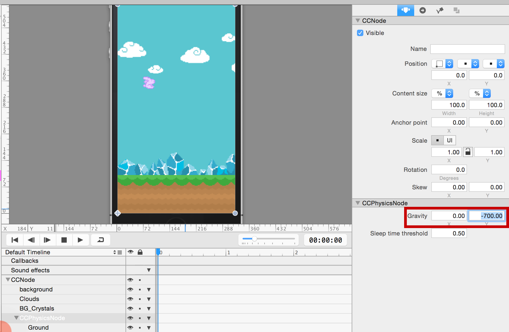
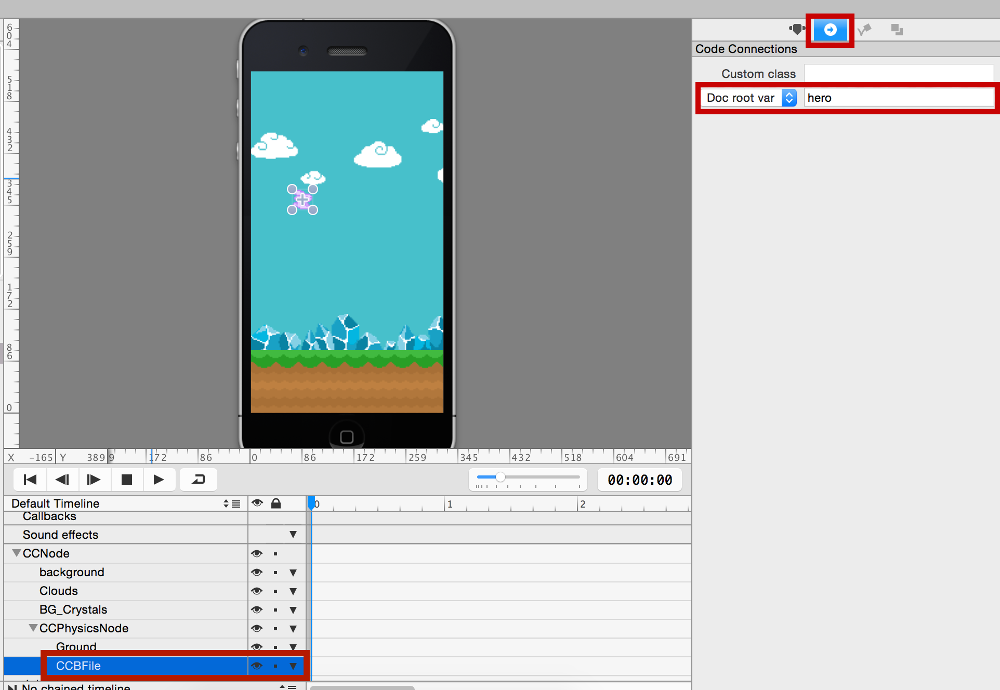

At the moment the bunny drops to the floor (slowly) and there is nothing a player can do to stop this! In this section you are going to tune some physics values and add touch controls so that the player can stop the bunny from falling down.

#Change the gravitational constant of the universe

> [action]
> Let's [just redefine gravity](https://www.youtube.com/watch?v=5xdbPhnfFEI) by selecting the physics node in the *MainScene.ccb*, then increase the gravity property to -700 to make the bunny drop faster:
>
> 

#Making code connections

Before we can control the bunny via Xcode, we first must make a connection to it in SpriteBuilder. 

> [action]
> Select your bunny in *MainScene.ccb*. **Make sure you've selected the bunny - a common mistake is to create code connections with the wrong CCNodes.** Go to the code connections tab (second tab on the top-right) and give the bunny the *Doc root var* name *hero*:
>
> 

Be sure to publish your project! 

> [action]
> Go to Xcode and navigate to *MainScene.swift*. In order to control our bunny, we need to complete the code connection. Make your  *MainScene.swift* look like the following:
>
>        import Foundation
>
>        class MainScene: CCNode {
>           weak var hero: CCSprite!
>
>
>        }

We now have what's called a reference to the bunny, which means we can manipulate the specific bunny object we placed in *MainScene.ccb* by using `hero` in *MainScene.swift*. But what good is a reference if we don't do anything with it? Let's start hopping!

> [info]
> We'll always use the format `weak var codeConnectionName: Type!` when completing code connections in code. We'll explain what this means later after you have some more Swift experience.

#Adding touch input

Our goal is to have our bunny hop every time we touch the screen.

> [action]
> First, let's enable touch events in *MainScene.swift* by adding the method `didLoadFromCCB()`, which is called every time a CCB file is loaded. Inside the method, we'll enable touch events. Add the following method to the *MainScene* class - that is, within the `{}` brackets in *MainScene.swift*, the same place we just put our `hero` code connection:
>
>        func didLoadFromCCB() {
>           userInteractionEnabled = true
>        }
>
> Then add another method to *MainScene* class (again, make sure it is within the `{}` brackets) which applies an impulse to the bunny every time a touch is first detected:
>
>        override func touchBegan(touch: CCTouch!, withEvent event: CCTouchEvent!) {
>            hero.physicsBody.applyImpulse(ccp(0, 400))
>        }

You'll notice the keyword `override` appears before `func` in the declaration of this method. An important concept in object-oriented programming is the idea of inheritance - that is, a child class inherits methods and properties from its parent class. *MainScene.swift* is a child of *CCNode*, which is indicated by the line `MainScene: CCNode`. *CCNode* has a `touchBegan(...)` method, so we must use the `override` keyword to indicate that our child class will override its parent's implementation of `touchBegan(...)`.

> [info]
> For now it is best to use the physics values provided in this tutorial. Once you completed the tutorial you can spend time tweaking the values.

Run the game again to verify that the bunny can be controlled by touches.

#Adding a speed limit

As you may have noticed while testing the touch implementation, when you touch the screen repeatedly in short intervals, the impulses add up and the bunny shoots out of the top edge of the screen, gone for seconds or even (seemingly) forever. To make the game playable, you will want to limit the vertical upward velocity. The best way to limit the bunny's speed is via the *update* method, which is called every frame in a Cocos2D object.

> [action]
> Add the following method to *MainScene.swift* to limit the bunny's vertical velocity:
>
>        override func update(delta: CCTime) {
>           let velocityY = clampf(Float(hero.physicsBody.velocity.y), -Float(CGFloat.max), 200)
>           hero.physicsBody.velocity = ccp(0, CGFloat(velocityY))
>        }

Clamping means testing and optionally changing a given value so that it never exceeds the specified value range.

In this method, you are limiting the upwards velocity to 200 at most. By using the negative *-Float(CGFloat.max)* value as the minimum value, you avoid artificially limiting the falling speed. You don't need to set the x velocity because you will be setting the x *position* manually, so modifying the x velocity here would have no effect.

#Make the bunny rotate

One of the nice details of Flappy Bird is the way the bird rotates. When the player does not touch the screen for a little while, the bird turns towards the ground. Touching the screen makes the bird turn upwards again. You are going to imitate this behavior in Hoppy Bunny!

There are a couple of things you will need to do to achieve this:

*   On touch, turn the bunny upwards
*   If no touch occurred for a while, turn the bunny downwards
*   Limit the rotation between slightly up and 90 degrees down (just like Flappy Bird)

> [action]
> The first step is to add a property to keep track of the time since the last touch. Add this declaration just below the code connection you made:
>
>       var sinceTouch : CCTime = 0
>
> Next, extend the touch method to trigger the upward rotation on a touch. You implement this by applying an angular impulse to the physics body. You also need to reset the *sinceTouch* value every time a touch occurs:
>
>       override func touchBegan(touch: CCTouch!, withEvent event: CCTouchEvent!) {
>           hero.physicsBody.applyImpulse(ccp(0, 400))
>           hero.physicsBody.applyAngularImpulse(10000)
>           sinceTouch = 0
>       }

This is how your *touchBegan* method should look now. Applying a high angular impulse will lead to the bunny turning upwards fast. If you like to see the bunny spinning wildly, go ahead and try the game now.

You still need to limit the rotation of the bunny and start a downward rotation if no touch occurred in a while. You will do both in the update method. 

> [action]
> Add these lines at the end of your update method:
>
>        sinceTouch += delta
>        hero.rotation = clampf(hero.rotation, -30, 90)
>        if (hero.physicsBody.allowsRotation) {
>            let angularVelocity = clampf(Float(hero.physicsBody.angularVelocity), -2, 1)
>            hero.physicsBody.angularVelocity = CGFloat(angularVelocity)
>        }
>        if (sinceTouch > 0.3) {
>            let impulse = -18000.0 * delta
>            hero.physicsBody.applyAngularImpulse(CGFloat(impulse))
>        }

There are a couple things going on here. First, you add the *delta* (change in) time to the *sinceTouch* value to capture how much time has passed since the last touch. In the next line, we limit the rotation of the bunny.

Next, you check if the bunny allows rotation because later, you will disable rotation upon death. If rotation is allowed, you clamp the angular velocity to slow down the rotation if it exceeds the value range. Then you apply that new angular velocity.

Finally, you check if more than three tenths of a second passed since the last touch. If that is the case, a strong downward rotation impulse is applied.

Now run your game again. The behavior should be similar to this:

Hopping up and down is fun, but it would be even better if our bunny was going somewhere!
