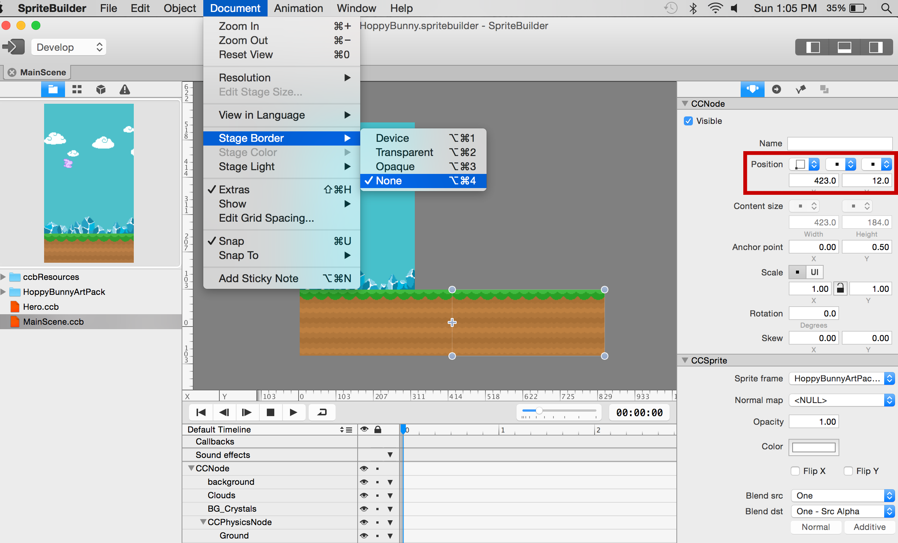

You are going to begin by moving the bunny with a constant speed while updating the positions of movable objects.

> [action]
> Publish your Spritebuilder project and open Xcode. We need to define a new member variable, which we will call `scrollSpeed`. Add the following line to *MainScene.swift* near the other member variables of the class:
>
>        var scrollSpeed : CGFloat = 80

Now you need to use that variable to manipulate the scroll speed of your bunny! 

> [action]
> Add the following line to the `update(...)` method in *MainScene.swift*:
>
>        hero.position = ccp(hero.position.x + scrollSpeed * CGFloat(delta), hero.position.y)

Great, now we should have some movement!

> [info]
> Defining a member variable for the scroll speed rather than simply defining the hero's position to be increased by *80* * *delta* every time is an important programming practice. Variable names offer us clarity - if someone else looks at your code, or even if you revisit it next week, it may not be clear what *80* affects. Explicitly using the variable `scrollSpeed` alleviates this problem. They also offer us flexibility. Imagine we were writing a larger program which used `scrollSpeed` in several places and instead of using a variable, we used *80* every time. What happens if we decide our scroll speed is a little slow? We will need to visit every place we wrote *80* and change it. It's not hard to understand how this could quickly get messy and inefficient.
>
> By multiplying the scroll speed with *delta* time you ensure that the bunny always moves at the same speed, independent of the frame rate.
>
> **Caution:** Setting the position of a node with a physics body manually in the update method is generally not the best use of the physics engine, since a node with a physics body is supposed to have its position updated by the body. However, in this game, collisions are not resolved - they are merely used to sense the player (1) passing through gates and (2) hitting the obstacles.

Once you added this code, you can run your game. You should see the bunny slowly leaving the screen.

You're right -- as a next step you should definitely set up some kind of "camera" that follows the bunny.

#Setting up a "camera"

Cocos2D does not have the concept of a camera - though *CCActionFollow* comes close to it. For now, you will have to implement the camera mechanism by yourself - with our help, of course - and it's actually rather straightforward.

You can scroll the view by moving the complete content of the game to the left. To the player, this looks the same as if the camera is moving to the right - in the end, all movement is relative.

Just as in Flappy Bird, the background images will be all static. The only things scrolling will be the obstacles and the ground. To implement the camera, you just need to move the *Physics Node* to the left - obstacles, ground and hero are children of the physics node and will move in relation to their physics node parent.

To scroll the physics node in code, you need to setup a code connection for the physics node.

> [action]
> Select the physics node, then enter *gamePhysicsNode* in the *doc root var* field:
>
> 
>
>Now switch to Xcode and create a new property called *gamePhysicsNode* for this code connection. Add the following line to *MainScene.swift* just below the line that declares the *hero* property:
>
>        weak var gamePhysicsNode : CCPhysicsNode!
>
>Next, you are going to add a line to your update method immediately after updating the hero's position which moves the physics node:
>
>        hero.position = ccp(hero.position.x + scrollSpeed * CGFloat(delta), hero.position.y)
>        gamePhysicsNode.position = ccp(gamePhysicsNode.position.x - scrollSpeed * CGFloat(delta), gamePhysicsNode.position.y)

Test out your game again!

Yay, the scrolling works! However, when the game scrolls too far to the right the ground disappears and the bunny drops into nirvana. The problem is that by moving the complete physics world to the left, you are also moving the ground to the left but it is only wide enough to fill the width of one screen.

#Loop the ground

You can make the ground loop by adding a second ground sprite and implementing an endless scrolling using both ground sprites. When a ground sprite leaves the left edge you'll move it to the right edge of the screen to make the ground seem endlessly repeating.

The first step will be adding a second ground sprite to the *MainScene.ccb*. 

> [action]
> It will help to turn off the iPhone frame by changing the *Stage Border* to *None* for the moment. Do this by selecting Document -> Stage Border -> None.
>
> The easiest way to create another ground sprite is to duplicate the existing one via *Edit => Copy* and *Edit => Paste*. This has the advantage that you can make all settings below to one sprite, then copy it and only apply properties that are different. Alternatively you can just add a second ground image to the stage.
>
> 
>
> Drag the duplicated ground sprite below the *CCPhysicsNode*, if necessary. Set its position to (423,12). *423* is the width of the ground image, *12* is the y-Position of the first ground sprite. **Also set the anchor point to (0, 0.5), the same as the first ground sprite**. This way the two ground sprites will line up nicely.
>
> There are a couple of important steps to implement:
>
> *   Ensure both ground sprites have physics enabled, and are set to be *Static* physics bodies
> *   Create a *doc root var* code connection for both ground sprites:
> *   Name the first var *ground1*
> *   Name the other var *ground2*

If you followed all the steps closely, you are now ready to go back to Xcode... But don't forget to publish your project!

#Coding the ground

In code, you will have to add *ground1* and *ground2* properties for both ground sprites to complete the code connection.

You should also add an array that will contain both of the ground sprites for easier processing later on. 

> [action]
> Insert the following code to the *MainScene* class, between the *gamePhysicsNode* var declaration and the *update* function:
>
>        weak var ground1 : CCSprite!
>        weak var ground2 : CCSprite!
>        var grounds = [CCSprite]()  // initializes an empty array
>    
>        func didLoadFromCCB() {
>            userInteractionEnabled = true
>            grounds.append(ground1)
>            grounds.append(ground2)
>        }

In *didLoadFromCCB*, you assign the two ground sprites to the *grounds* array to be able to loop through the ground sprites instead of having to juggle with the two identifiers *ground1* and *ground2*. The array is initialized when declared by simply assigning it an empty array. This avoids having to implement the *init* function.

In the update method, you will perform a check for each ground sprite to see if it has moved off the screen, and if so, it will be moved to the far right and next to the ground sprite that's currently still visible on the screen.

> [action]
> Add the following chunk of code to the bottom of the `update(...)` method in *MainScene.swift*:
>
>        // loop the ground whenever a ground image was moved entirely outside the screen
>        for ground in grounds {
>            let groundWorldPosition = gamePhysicsNode.convertToWorldSpace(ground.position)
>            let groundScreenPosition = convertToNodeSpace(groundWorldPosition)
>            if groundScreenPosition.x <= (-ground.contentSize.width) {
>                    ground.position = ccp(ground.position.x + ground.contentSize.width * 2, ground.position.y)
>            }
>        }

This code retrieves the current screen position for each ground sprite. Since the ground sprites aren't children of the *MainScene* (*self*), you need to get the world position of the ground sprites first, then use the *convertToNodeSpace* method to convert the position in *MainScene* (*self*) coordinate space.

Once you have the position, you check if a ground sprite is off the screen. If that is the case, you move it to the right of the other ground sprite. This creates the ground's endless repeating effect.

If you run the game now, the ground will scroll endlessly as the bunny moves about.