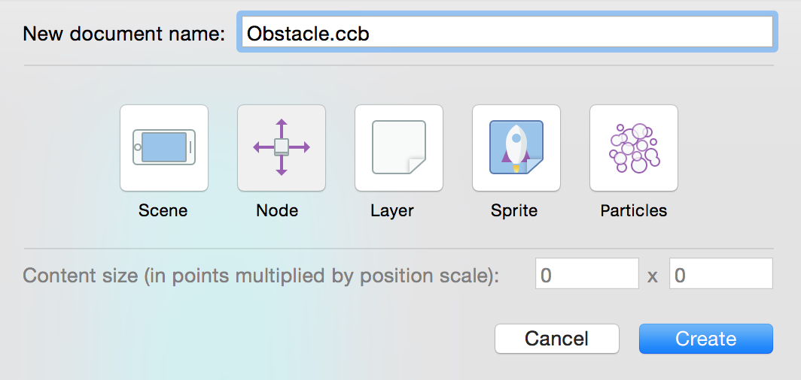
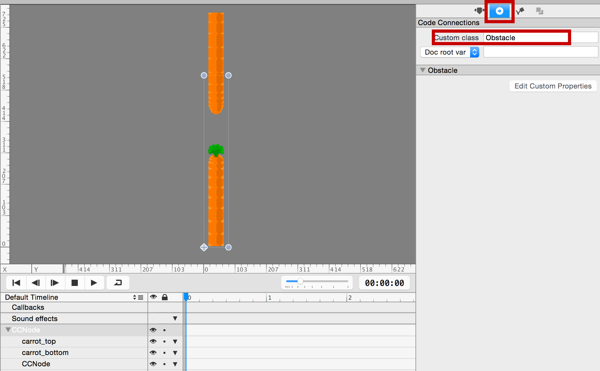
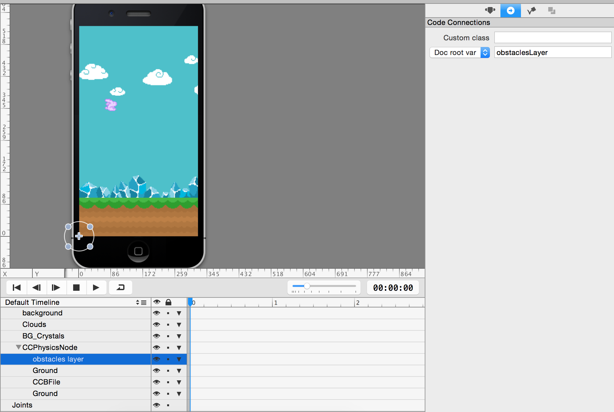

Now you will be adding obstacles and implement a mechanism to randomly create more obstacles as you hop along the level.

> [action]
> Go back to SpriteBuilder and create a new *CCB File* of type *Node* for the obstacles:
>
> 

You will construct the obstacles with two carrots, one at the top and one at the bottom and *CCNode* in between which will be used as a goal trigger - the player's score increases when colliding with the goal node.

> [action]
> To the *root node*:
> 
> *  add carrot_top.png
> *  add carrot_top.png
> *  add CCNode
> *  set *content size* to `(80, 568)`
> *  set *anchor point* to `(0, 0)`
> 
> To *carrot_top*:
> 
> *  set *reference corner* to `Top-left`
> *  set *X position* to `50%`
> *  set *Y position* to `128.0`
> *  set *anchor point* to `(0.5, 0)`
> 
> To *carrot_bottom*:
> 
> *  set *reference corner* to `Top-left`
> *  set *X position* to `50%`
> *  set *Y position* to `228.0`
> *  set *anchor point* to `(0.5, 1)`
> 
> To *CCNode*:
> 
> *  set *reference corner* to `Top-left`
> *  set *position* to `(22, 576)`
> *  set *anchor point* to `(0, 0)`
> 
> Your obstacle should look something like this:
> 
> 

It is important to get the pipe's positions right, to ensure that the obstacles look the same on an 3.5-inch and a 4-inch phone.

> [action]
> You can test if you setup the obstacle correctly by adding an instance of *Obstacle.ccb* to the *MainScene.ccb* by dragging the *Obstacle.ccb* onto the *MainScene.ccb* stage. Be sure to save the *Obstacle.ccb* document because CCB instances (represented by *Sub File* nodes) will always use the state of a document when it was last saved, but won't show any (as of yet) unsaved modifications. The result should be similar to this one:
>
> 

Once you have successfully tested that the obstacle looks correct, remove it from *MainScene.ccb,* as you will write code to add obstacles.

#Generate obstacles in code

In this step you will create the obstacles from the *Obstacle.ccb* and add them to the game.

> [action]
> Open Xcode and add the following properties to *MainScene.swift* right next to the other properties:
>
>        var obstacles : [CCNode] = []
>        let firstObstaclePosition : CGFloat = 280
>        let distanceBetweenObstacles : CGFloat = 160

You will use the *obstacles* array to keep track of the obstacles created. The two constants describe the x position of the first obstacle and the distance between two obstacles.

> [action]
> Now add the method that will take care of spawning obstacles:
>
>        func spawnNewObstacle() {
>            var prevObstaclePos = firstObstaclePosition
>            if obstacles.count > 0 {
>                prevObstaclePos = obstacles.last!.position.x
>            }
>    
>            // create and add a new obstacle
>            let obstacle = CCBReader.load("Obstacle")
>            obstacle.position = ccp(prevObstaclePos + distanceBetweenObstacles, 0)
>            gamePhysicsNode.addChild(obstacle)
>            obstacles.append(obstacle)
>        }

This method creates a new obstacle by loading it from the *Obstacle.ccb* file and places it within the defined distance of the last existing obstacle. If no other obstacles already exist the position of the first obstacle will be set to the *firstObstaclePosition* constant you just defined.

Now all you have to do is to call this method from the *didLoadFromCCB* method, which is called as soon as our scene's CCB document was initialized.

> [action]
> Add this to the end of the *didLoadFromCCB* method:
>
>        spawnNewObstacle()
>        spawnNewObstacle()
>        spawnNewObstacle()

This spawns three obstacles initially. You can try out the game now. You should see exactly three obstacles passing by, all at the same height, followed by - nothingness.

This will be our next task: spawning an endless number of obstacles!

#Spawning endless obstacles

You will now implement a mechanism that checks if an obstacle moved off the screen and if so, spawns a new obstacle in place of this one. Alternatively, you can later try to re-use the obstacle that moved off-screen since loading resource files at runtime is quite slow - it's fine for this game but if you do that 10 to 100 times more often, that could become a performance issue.

> [action]
> Add these lines to the end of your *update* method:
>
>        for obstacle in obstacles.reverse() {
>            let obstacleWorldPosition = gamePhysicsNode.convertToWorldSpace(obstacle.position)
>            let obstacleScreenPosition = convertToNodeSpace(obstacleWorldPosition)
>    
>            // obstacle moved past left side of screen?
>            if obstacleScreenPosition.x < (-obstacle.contentSize.width) {
>                obstacle.removeFromParent()
>                obstacles.removeAtIndex(find(obstacles, obstacle)!)
>    
>                // for each removed obstacle, add a new one
>                spawnNewObstacle()
>            }
>        }

The basics of this code should remind you of the ground looping we implemented previously. It checks whether obstacles are off the screen and if so, removes that obstacle, then spawns a new obstacle.

> [info]
> Note that we enumerate the *obstacles* array in reverse (backwards) so that we can legally remove and add objects at the end of the array while enumerating. More precisely: when enumerating an array in reverse, it is legal to modify the contents of the array at indexes equal to or higher than the index that's currently being processed. This is a neat trick to avoid having to fill a "to be deleted" array with another for loop that removes the items in the "to be deleted" list for good.

Now run your game. You should see an endless amount of scrolling obstacles! They're still all at the same height, but you're getting closer to completing *Hoppy Bunny Swift*!

#Generating randomized obstacles

The next challenge you are going to tackle is generating randomized obstacles. This means you need to be varying the position of the gap between the two pipes. The first step is setting up a custom class for the obstacle.

> [action]
> First, open *Obstacle.ccb* in SpriteBuilder, select the root CCNode and assign it the custom class *Obstacle*:
>
> 
>
> Also set up a *doc root var* code connection for the top and the bottom pipe sprites in the *Obstacle.ccb*. Enter in the *doc root var* field *topCarrot* for the carrot\_top sprite and *bottomCarrot* for the carrot\_bottom sprite.
>
> Once you have setup everything, publish and create a new Swift class named *Obstacle* in Xcode.
>
> Here's the complete content of the *Obstacle.swift* file. Add the following code to *Obstacle.swift*:
>
>        import Foundation
>     
>        class Obstacle : CCNode {
>            weak var topCarrot : CCNode!
>            weak var bottomCarrot : CCNode!
>     
>            let topCarrotMinimumPositionY : CGFloat = 128
>            let bottomCarrotMaximumPositionY : CGFloat = 440
>            let carrotDistance : CGFloat = 142
>     
>            func setupRandomPosition() {
>                 let randomPrecision : UInt32 = 100
>                 let random = CGFloat(arc4random_uniform(randomPrecision)) / CGFloat(randomPrecision)
>                 let range = bottomCarrotMaximumPositionY - carrotDistance - topCarrotMinimumPositionY
>                 topCarrot.position = ccp(topCarrot.position.x, topCarrotMinimumPositionY + (random * range));
>                 bottomCarrot.position = ccp(bottomCarrot.position.x, topCarrot.position.y + carrotDistance);
>            }
>        }

What is happening here?

At the top of the class you define the carrot code connections and a couple of constants. These constants describe the minimum and maximum positions for the top and bottom carrots.

The values were chosen in such a way that every carrot at the top reaches at least 30 points into the screen for a 3.5-inch iPhone. This means on an iPhone 4S or older the top obstacle will always be clearly visible. The iPhone 5 and 5s will see a larger portion of the top carrot, but this will not change anything about the gameplay. Likewise, the maximum value for the bottom carrot is defined such that a carrot always sticks at least 30 points out of the ground to make it clearly visible.

In addition, you defined a *carrotDistance* that describes how large the opening gap between the carrots should be.

Next the method *setupRandomPosition* uses the defined border values to calculate a random range. Since *arc4random* uses and returns *UInt32* it's important to generate a high enough number (here: *randomPrecision*), then divide by that same number to get a floating point value in the range 0.00 to 1.00.

The random value is used to define which portion of the possible carrot position Y range will be used. It uses the result to position the top carrot and positions the bottom carrot at the desired distances.

You can now use this method to generate random obstacles in our game. In *MainScene.swift* change the *spawnNewObstacle* method used to load an *Obstacle.ccb* document. All you really need to change is the CCBReader line to declare the value returned and assigned to the *obstacle*  constant as being of class *Obstacle*, then calling the *setupRandomPosition* method after assigning the initial position. 

> [action]
> The lines you need to replace respectively add are marked with appended comments:
>
>        func spawnNewObstacle() {
>            var prevObstaclePos = firstObstaclePosition
>            if obstacles.count > 0 {
>                prevObstaclePos = obstacles.last!.position.x
>            }
>    
>            let obstacle = CCBReader.load("Obstacle") as! Obstacle   // replace this line
>            obstacle.position = ccp(prevObstaclePos + distanceBetweenObstacles, 0)
>            obstacle.setupRandomPosition()   // add this line
>            gamePhysicsNode.addChild(obstacle)
>            obstacles.append(obstacle)
>        }

In the above code the return value of *CCBReader.load()* is cast to *as! Obstacle* so that we can treat the loaded *Obstacle.ccb* as an instance of the *Obstacle* class. Additionally, the new *setupRandomPosition* method you just implemented is called after loading an obstacle.

If you run the game now you should see random obstacles occurring! Before you move on to the last major step - implementing collisions - you are going to fix a small issue with the drawing order.

#Fixing the drawing order

Because you add the carrots in code, they are all drawn in front of the ground. By default Cocos2D renders the elements in the same order they were added as children, so the node(s) added last will be drawn on top of their sibling nodes.

While you can use the zOrder property to fix that, it's a lot easier to use "layers". Basically all you need to create a layer is to add another node (acting as a "layer") in SpriteBuilder at the correct position in the hierarchy. Then add all objects that should be drawn in the same order to that "layer" node.

> [action]
> Open *MainScene.ccb* in SpriteBuilder and drag a *Node* from the Node Library View onto the CCPhysicsNode. Drag and move the newly added node so that it is the first node after CCPhysicsNode, and you may want to rename it to "obstacles layer":
>
> 
>
> Then select that *obstacles layer* node and set up a code connection. In the *doc root var* field enter *obstaclesLayer*.
>
> Back in Xcode, add the following property to the end of the properties list in the *MainScene.swift* file:
>
>        weak var obstaclesLayer : CCNode!
>
> Finally, update the *spawnNewObstacle* method so that new obstacles aren't added to the *gamePhysicsNode* anymore, but rather the new *obstaclesLayer* (I've omitted some code, and commented the line you need to replace):
>
>        let obstacle = CCBReader.load("Obstacle") as! Obstacle
>        obstacle.position = ccp(prevObstaclePos + distanceBetweenObstacles, 0)
>        obstacle.setupRandomPosition()
>        obstaclesLayer.addChild(obstacle)   // replace this line
>        obstacles.append(obstacle)

Now you can run the App and see the pipes drawn behind the ground:

