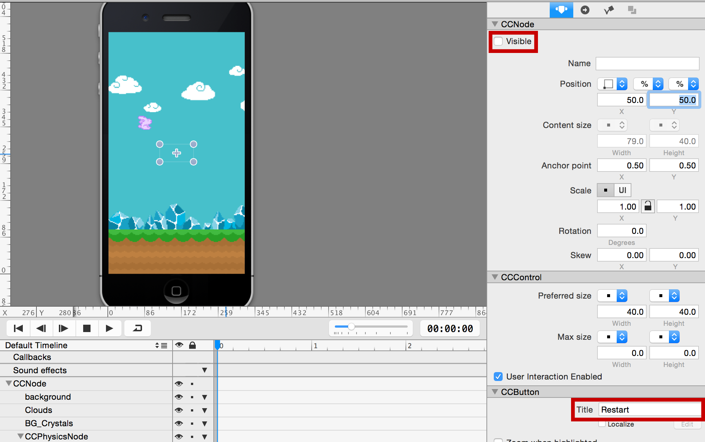
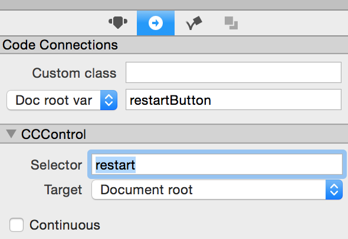

You are going to set up collision handling so that your game finally becomes as frustrating as *Flappy Bird*. Any good game needs to be unforgiving and frustrating, right?

> [action]
> First, open *Obstacle.ccb* in SpriteBuilder in order to enable physics for the carrots. Select one of the two carrots, switch to the Item Physics tab and check the *Enable Physics* checkbox. Change the body type to *Static* and enter *level* in the *Collision Type* field, as shown in the screenshot below. Do this for both pipes.
>
> 
>
> Then open *MainScene.ccb* and set the *Collision Type* for both ground nodes to *level* as well.
>
> Lastly, open *Hero.ccb*, select the CCSprite root node, and enter *hero* in the *Collision Type* field.

You set the collisionType to "level" to implement a collision callback method later whenever the "hero" collision type collides with a deadly "level" object (obstacles and the ground). Feel free to optimize the collision shapes for the carrots and the hero - they simply default to rectangular shapes, which will make the collision behavior somewhat unforgiving.

> [action]
> Open *Obstacle.swift* in Xcode and add the *didLoadFromCCB* method to the *Obstacle* class with the following two lines:
>
>        func didLoadFromCCB() {
>            topCarrot.physicsBody.sensor = true
>            bottomCarrot.physicsBody.sensor = true
>        }

This changes the carrot's physics bodies to sensors. Setting the *sensor* value to *true* tells Chipmunk no actual collision feedback should be calculated, meaning the collision callback method does run but sensors will always allow the colliding objects to pass through the collision.

You don't need an actual collision here because just touching an obstacle means instant death, just like in that other game ... what's it called ... ah, yes: *Flappy Bird*.

> [action]
> In *MainScene.swift* you need to declare that the *MainScene* class will implement (some of) the *CCPhysicsCollisionDelegate* protocol methods. You declare that a class is [implementing a protocol in Swift](https://developer.apple.com/library/ios/documentation/Swift/Conceptual/Swift_Programming_Language/Protocols.html) by appending *CCPhysicsCollisionDelegate* after the class' super class (CCNode), separated by a comma, as follows:
>
>       class MainScene: CCNode, CCPhysicsCollisionDelegate

The *MainScene* class is now ready to be used as collision delegate.

> [action]
> You should assign *MainScene* as the collision delegate class by adding the following line (anywhere) to the *didLoadFromCCB* method:
>
>        gamePhysicsNode.collisionDelegate = self

Finally, you can implement a collision handler method. As parameter names you have to use the collision types *level* and *hero* that you defined earlier. 

> [action]
> Add this method to the *MainScene* class:
>
>        func ccPhysicsCollisionBegin(pair: CCPhysicsCollisionPair!, hero: CCNode!, level: CCNode!) -> Bool {
>            println("TODO: handle Game Over")
>            return true
>        }

The method above will be called whenever a object with collision type *hero* collides with an object of collision type *level*.

Publish and run the app in Xcode. Any time you collide with the ground or a carrot, the *TODO* message will be printed to the console.

#Implementing "game over"

Instead of only showing a message in the console, you surely want to implement a game over situation:

*   Bunny falls to ground
*   Screen rumbles
*   Restart button appears
*   Game restarts when restart button is pressed

> [action]
> First, add a Button in SpriteBuilder to the *MainScene.ccb* document (make sure it is NOT a child of the physics node). Center the button by setting its position to (50%,50%), change its *Title* to *Restart* and set it to be invisible by unchecking the *Visible* property highlighted below:
>
> 
>
> Set up a code connection for the button by entering *restartButton* in the *doc root var* field. Also enter *restart* in the *Selector* field, this will be the method that runs whenever the button is pressed.

You will make the button visible once the game over situation occurs.

> [action]
> Now switch to Xcode and open *MainScene.swift*, then add this property at the top of the class:
>
>    weak var restartButton : CCButton!
>
> Next, extend the collision handling method to show the restart button:
>
>        func ccPhysicsCollisionBegin(pair: CCPhysicsCollisionPair!, hero: CCNode!, level: CCNode!) -> Bool {
>            restartButton.visible = true;
>            return true
>        }
>
> Lastly, implement the *restart* method that will be called when the restart button is pressed:
>
>        func restart() {
>            let scene = CCBReader.loadAsScene("MainScene")
>            CCDirector.sharedDirector().presentScene(scene)
>        }

This method will reload the entire scene - restarting the game. Feel free to test this new functionality!

You will see that restarting the game works, but you don't have a real "game over" state yet. The scrolling goes on and there's no visualization of the game over situation.

> [action]
> Add a *gameOver* property at the beginning of the *MainScene* class, below or next to the other properties:
>
>       var gameOver = false
>
> Now add the new *triggerGameOver* method to *MainScene.swift*, ideally add it next to the *restart* method as they belong together:
>
>        func triggerGameOver() {
>            if (gameOver == false) {
>                gameOver = true
>                restartButton.visible = true
>                scrollSpeed = 0
>                hero.rotation = 90
>                hero.physicsBody.allowsRotation = false
>    
>                // just in case
>                hero.stopAllActions()
>    
>                let move = CCActionEaseBounceOut(action: CCActionMoveBy(duration: 0.2, position: ccp(0, 4)))
>                let moveBack = CCActionEaseBounceOut(action: move.reverse())
>                let shakeSequence = CCActionSequence(array: [move, moveBack])
>                runAction(shakeSequence)
>            }
>        }
>
> Then call this new method from the collision handler, instead of just making the restart button visible:
>
>        func ccPhysicsCollisionBegin(pair: CCPhysicsCollisionPair!, hero: CCNode!, level: CCNode!) -> Bool {
>            triggerGameOver()
>            return true
>        }
>
> You also need to update the *touchBegan* method to ensure that the user cannot "jump" when the game is over:
>
>        override func touchBegan(touch: CCTouch!, withEvent event: CCTouchEvent!) {
>            if (gameOver == false) {
>                hero.physicsBody.applyImpulse(ccp(0, 400))
>                hero.physicsBody.applyAngularImpulse(10000)
>                sinceTouch = 0
>            }
>        }

You should run your app again and test the game over sequence. There is only one last point left: the points!
