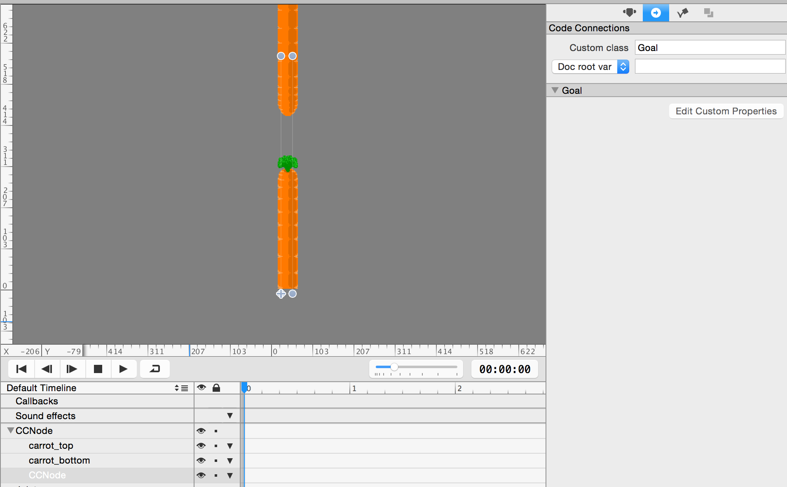

Now that the player can die, you should implement the very last step: scoring points.

> [action]
> First create a *LabelTTF* in *MainScene.ccb* to display the current score. Make the label any font you'd like. Display it in the middle of the screen near the top. Add a *doc root var* code connection to the label by entering *scoreLabel* in the corresponding field. It should look approximately like this when you're done:
>
> 
>
> Now open *Obstacle.ccb* to enable physics on the *goal* node between the pipes. Make it a *Static* body and change its *Collision Type* to *goal*. Then switch to the Code Connections tab and set its *Custom Class* to *Goal*:
>
> 
>
> Now switch to Xcode to implement increasing the score every time the player collides with one of the goals, which you take as the assumption that the player has passed (or at least reached) those pipes.
>
> Create a new Swift file and call it *Goal*. The initial contents of the *Goal.swift* file should be as follows:
>
>       import Foundation
>    
>       class Goal: CCNode {
>           func didLoadFromCCB() {
>               physicsBody.sensor = true;
>           }
>       }

So basically, you want to prevent the goal from stopping the player by making it a sensor body. This property can't (yet) be set within SpriteBuilder, so you have to do it in code.

> [info] 
> Of course you could also use the collision categories and masks, but that would be more complex and error-prone to set up and use up at least one category - and there can be at most 32 unique category strings. Alternatively, you could simply `return false` from the `ccPhysicsCollisionBegin` method but that should be a last resort option, since the Chipmunk manual recommends to use sensor or category filters first, as this will avoid the overhead of processing the collision and running the collision callback method.

You will use the *goal* collision type in *MainScene.swift* to detect when a player passed through a pipe.

> [action]
> Open *MainScene.swift* and add the following two properties (score label and the score) at the beginning of the class:
>
>        var points : NSInteger = 0
>        weak var scoreLabel : CCLabelTTF!

Now, as a very final step, implement a second collision handler in *MainScene* that will be called when the player reaches a goal.

> [action]
> Add this method to the *MainScene* class:
>
>        func ccPhysicsCollisionBegin(pair: CCPhysicsCollisionPair!, hero nodeA: CCNode!, goal: CCNode!) -> Bool {
>           goal.removeFromParent()
>           points++
>           scoreLabel.string = String(points)
>           return true
>        }

This will remove the goal node. Yes, in the Chipmunk physics engine it's legal to remove bodies during a physics collision callback method! Then the *points* counter is increased and assigned to the label's *string* property after it has been converted to a string.

> [info]
> **Note:** One frequently changing CCLabelTTF in a simple game like this is probably fine. But be aware that every time a CCLabelTTF string changes, the label's previous texture is discarded and a new one is created, then drawn using relatively slow Cocoa font rendering methods. See the performance note in the [CCLabelTTF class reference](http://www.cocos2d-swift.org/docs/api/Classes/CCLabelTTF.html).

Congratulations! Now you should see the complete game previewed at the beginning of this tutorial. You should have learned a lot along the way, especially regarding Swift and collision detection.
